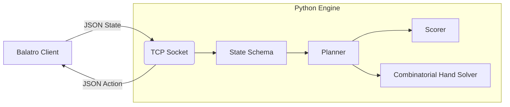

# Architecture

```mermaid
graph LR
    A[Balatro Client] -- JSON State --> B(TCP Socket)
    B -- JSON Action --> A
    subgraph Python Engine
        B --> C[State Schema]
        C --> D[Planner]
        D --> E[Scorer]
        D --> F[Combinatorial Hand Solver]
    end
```
