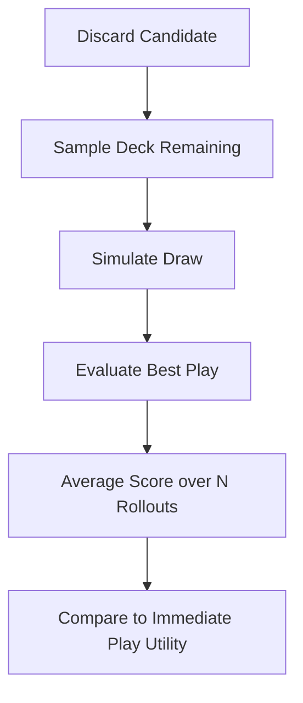

# Brain & Decision Logic

The agent reasoning goes beyond immediate greedy scoring and uses a structured probabilistic brain.

## Tactical Modes
1. **Lethal**: Blind can be cleared immediately. The agent minimizes cards spent to preserve economy.
2. **Safe Clear**: Blind is mathematically safe to clear across remaining hands. The agent plays conservatively.
3. **Desperation**: The agent is far behind the blind target. Discard EV is boosted to dig for rescuing synergies.
4. **Scaling-Preservation**: The agent is comfortably ahead and can afford to play weak hands to trigger scaling jokers or save specific cards.

## Utility Function
Actions are ranked by an objective utility function rather than raw chips:
`Utility = ExpectedScore + ModeBonuses - ResourcePenalties`

## Monte Carlo Discard Evaluator

