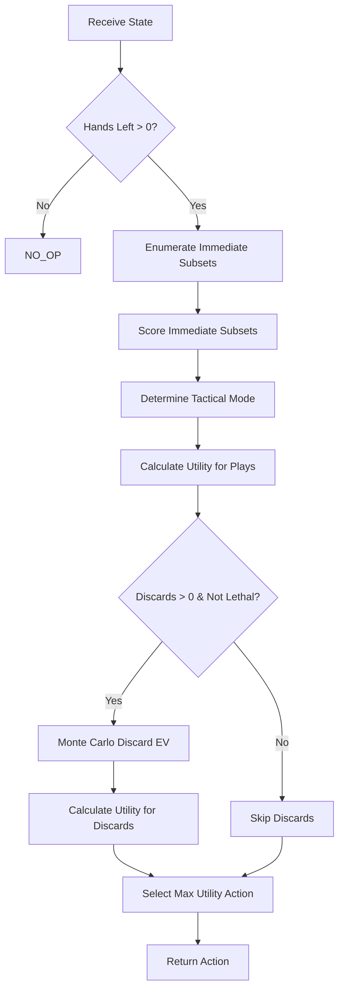

# Planner Decision Flow

```mermaid
graph TD
    A[Receive State] --> B{Hands Left > 0?}
    B -- No --> C[NO_OP]
    B -- Yes --> D[Enumerate Immediate Subsets]
    D --> E[Score Immediate Subsets]
    E --> F[Determine Tactical Mode]
    F --> G[Calculate Utility for Plays]
    G --> H{Discards > 0 & Not Lethal?}
    H -- Yes --> I[Monte Carlo Discard EV]
    I --> J[Calculate Utility for Discards]
    H -- No --> K[Skip Discards]
    J --> L[Select Max Utility Action]
    K --> L
    L --> M[Return Action]
```
