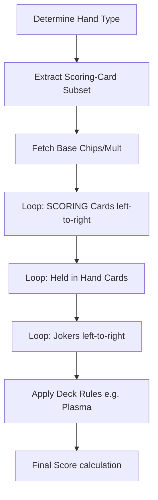

# Scoring Engine Design

The scoring pipeline explicitly aligns with Balatro's exact order of operations. It separates hand classification, subset determination, and effect triggering.

## Critical Mechanisms
* **Chips × Mult**: Final score is the product of accumulated chips and multiplier.
* **Scoring Subset**: Only the cards forming the valid poker hand are scored. If you play a Pair alongside 3 unrelated cards, only the Pair cards trigger their base chips and enhancements.
* **Retriggers**: Currently implemented with placeholders, but structurally anticipated. A Red Seal card must retrigger exactly during the scoring card loop.
