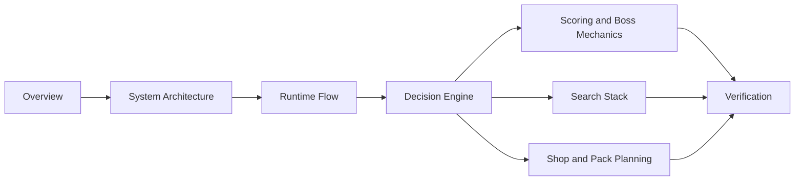

# Work Done So Far

This section documents the current Balatro agent in small, connected modules. Each page owns one slice of the system and uses Mermaid diagrams to show the moving parts before going into details.

## Reading Map

## Modules

- [System Architecture](system_architecture.md): repository layout, runtime components, and ownership boundaries.
- [Runtime Flow](runtime_flow.md): Lua bridge lifecycle, TCP protocol, async hand planning, and transition gating.
- [Decision Engine](decision_engine.md): phase routing, strategy model, planner ranking, tactical modes, and action selection.
- [Scoring and Boss Mechanics](scoring_and_boss_mechanics.md): hand classification, scoring order, joker hooks, boss overrides, and the debuffed-card audit fix.
- [Search Stack](search_stack.md): Python fallback search, exact discard enumeration, deterministic Monte Carlo, robust aggregation, and optional JS solver.
- [Shop and Pack Planning](shop_and_pack_planning.md): shop buys, rerolls, booster evaluation, pack choices, and run-plan influence.
- [Verification](verification.md): tests, smoke checks, current audit result, and documentation maintenance checklist.

## Current Status

```mermaid
flowchart TB
    A["Current Agent"] --> B["Lua Bridge"]
    A --> C["Python Backend"]
    A --> D["Decision Layers"]
    A --> E["Search"]
    A --> F["Verification"]

    B --> B1["Phase readiness"]
    B --> B2["UI button execution"]
    B --> B3["JSON state snapshots"]
    B --> B4["Transition gating"]

    C --> C1["Pydantic schema"]
    C --> C2["Phase router"]
    C --> C3["Planner"]
    C --> C4["Decision traces"]

    D --> D1["Strategy model"]
    D --> D2["Run planner"]
    D --> D3["Brain ranking"]
    D --> D4["Robust values"]

    E --> E1["Hand enumeration"]
    E --> E2["Exact discard math"]
    E --> E3["Shared-pool Monte Carlo"]
    E --> E4["JS round solver"]

    F --> F1["74 passing tests"]
    F --> F2["Compile check"]
    F --> F3["JS smoke test"]
```

## Audit Notes

The latest code audit found two concrete mechanics issues and patched both:

- Debuffed cards now still define the poker hand, while their card chips and card-triggered modifiers are ignored.
- The JavaScript round solver now reads `blind.boss_modifier` when setting boss flags such as The Flint and The Eye.

Those changes are covered by regression tests in:

- `tests/test_scorer.py`
- `tests/test_js_solver.py`
