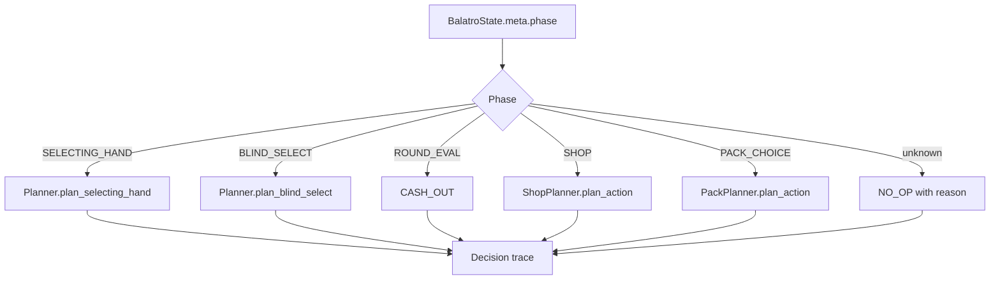
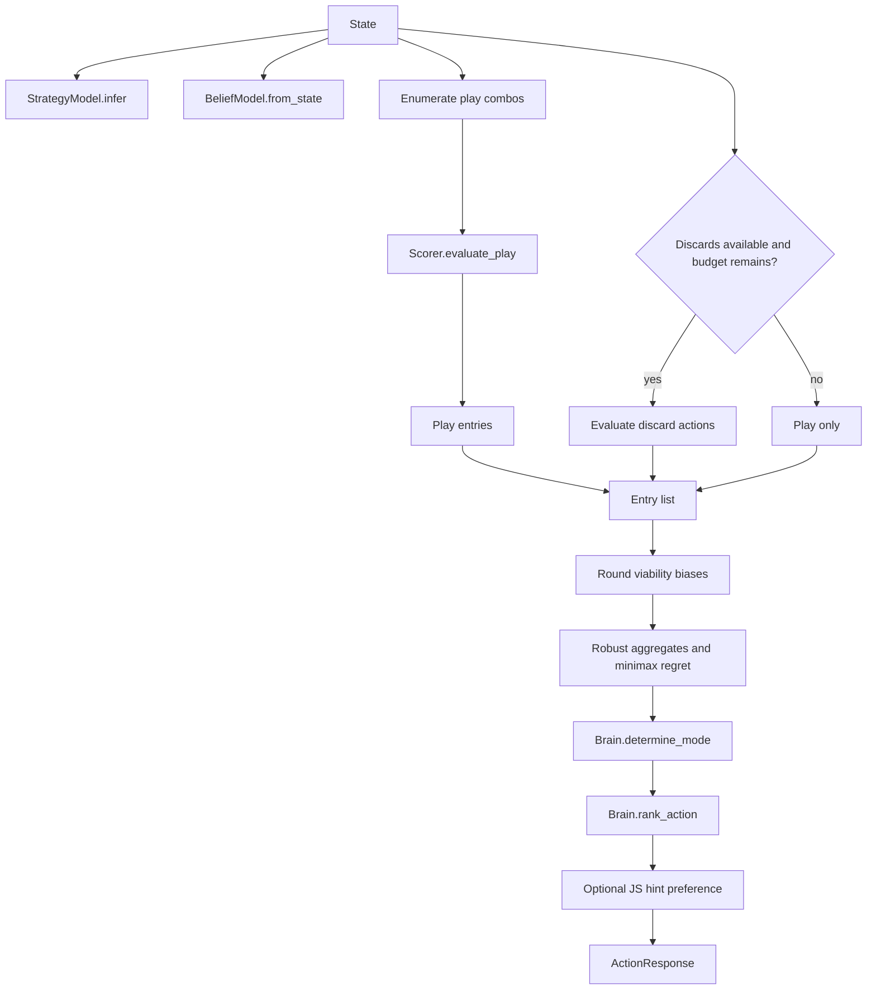
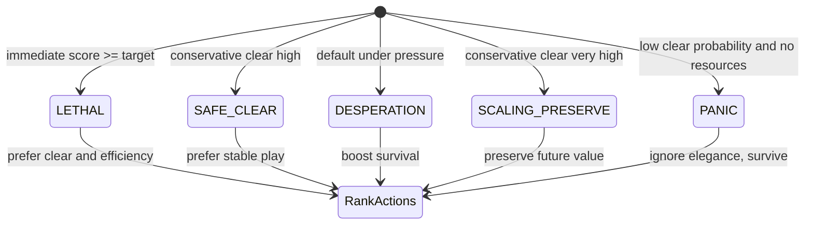
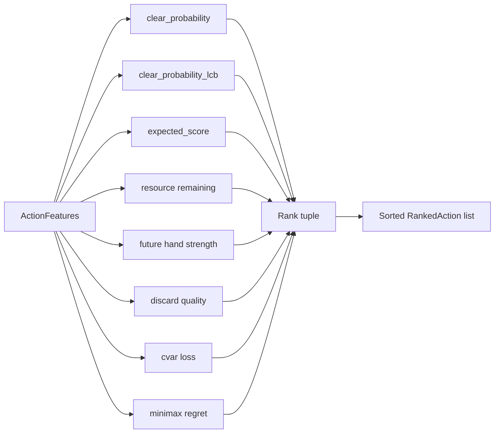
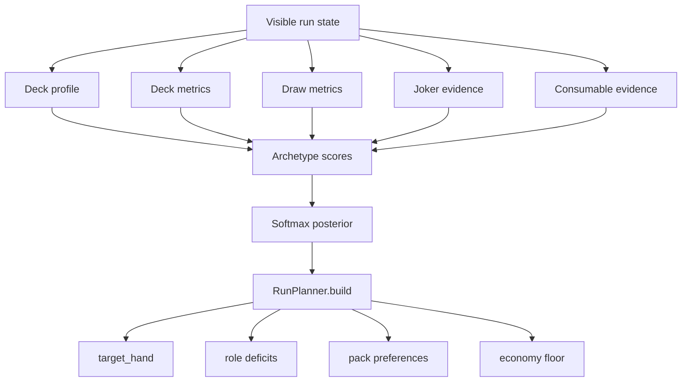

# Decision Engine

The Python planner is a phase router plus several decision layers. `Planner.plan_action` selects the relevant subsystem, then records the result through `DecisionTracer`.

## Phase Router

## Selecting-Hand Decision Stack

## Tactical Modes

## Ranking Inputs

## Strategy Layer

The decision engine is designed so tactical survival, long-run strategy, and exact scoring each have a clear place. That separation makes future tuning safer because a shop heuristic should not need to know about socket behavior, and a scoring mechanic should not need to know about run-stage strategy.

