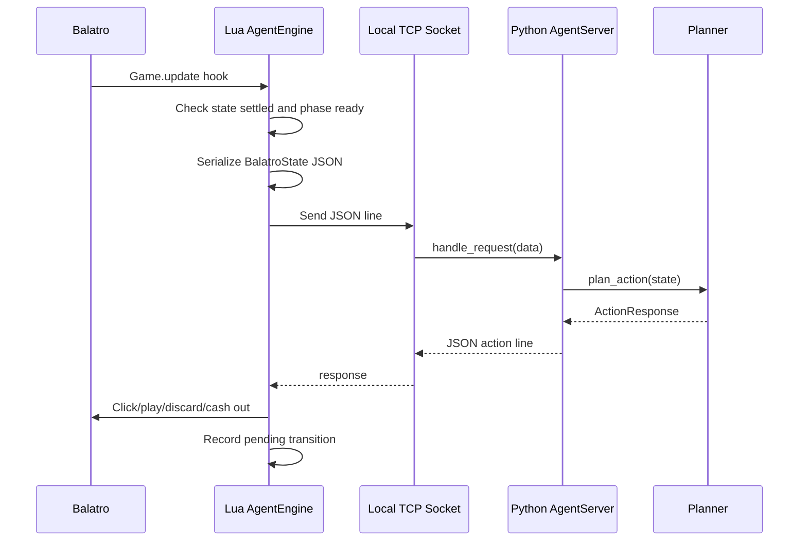
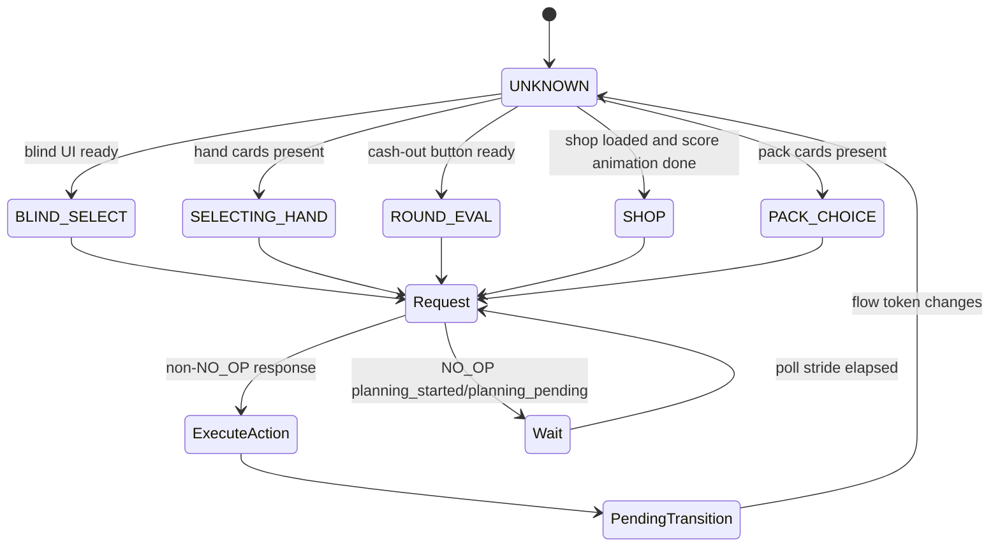
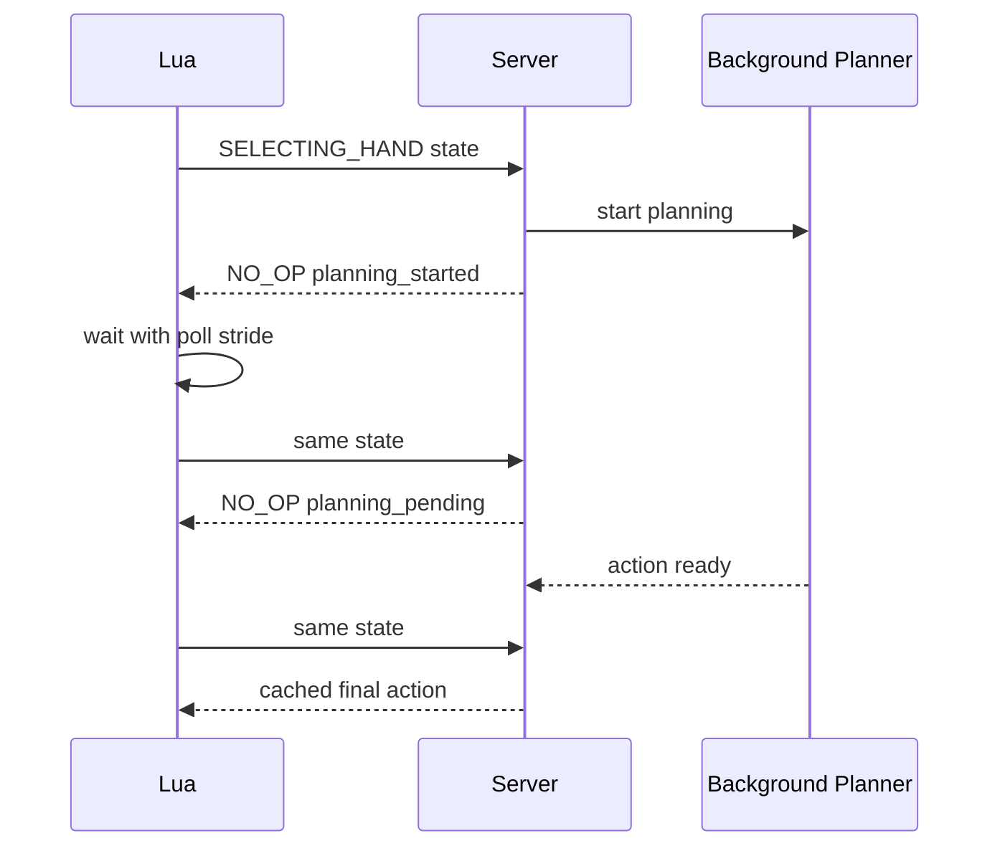
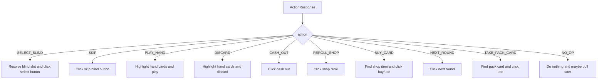
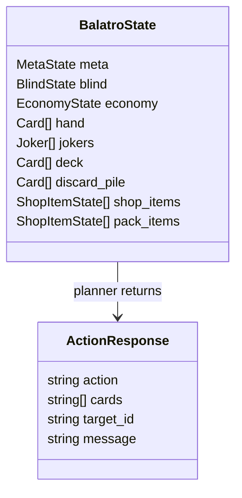

# Runtime Flow

The runtime loop is intentionally conservative. The Lua bridge only sends requests when the current phase is settled and the relevant UI is ready. The Python server can return `NO_OP` while deeper hand planning continues in the background.

## End-to-End Sequence

## Phase Readiness

## Async Selecting-Hand Flow

## Action Execution Surface

## Protocol Shape

The transport is deliberately simple: one JSON request line in, one JSON action line out. This keeps LuaSocket integration predictable and easy to inspect in logs.

