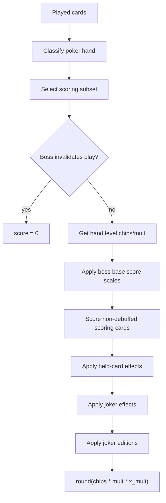
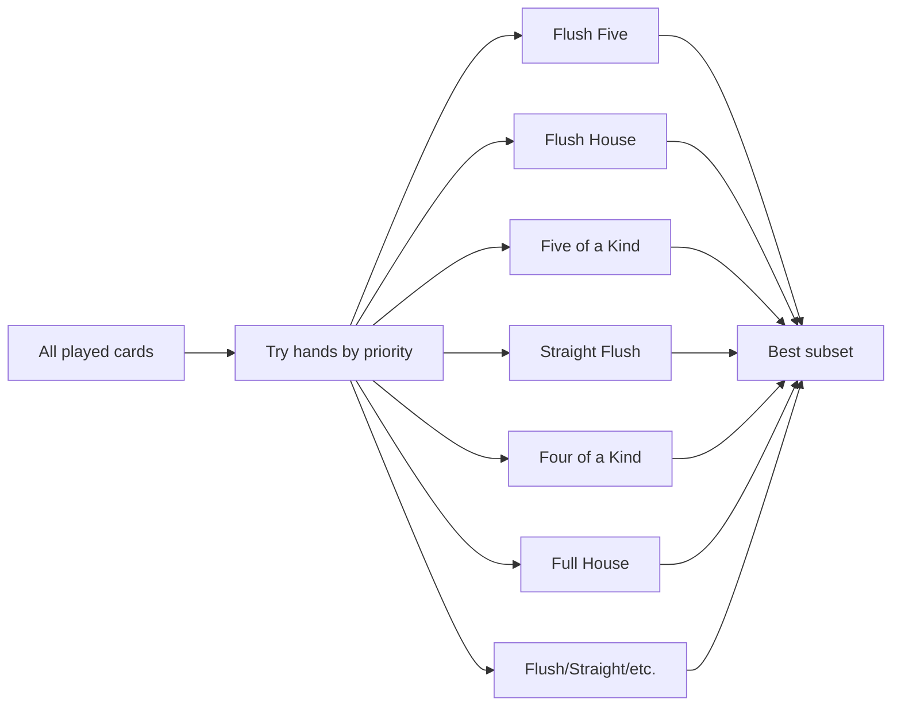
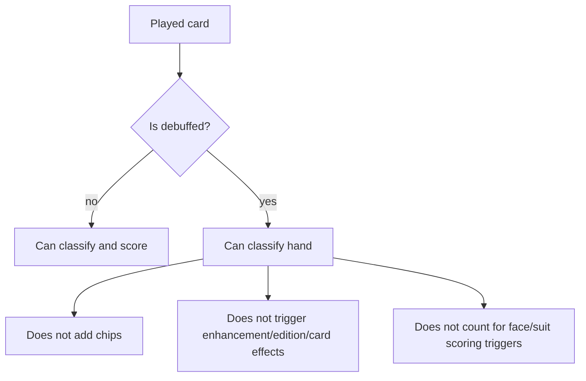
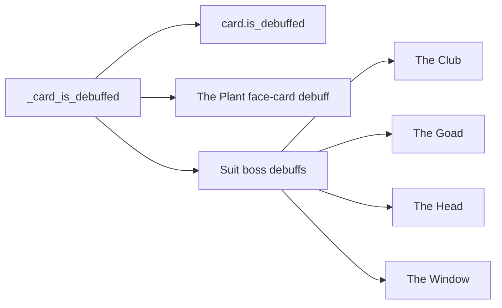
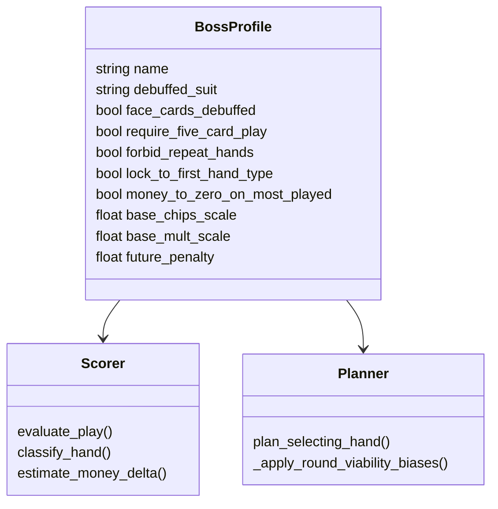
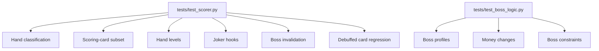

# Scoring and Boss Mechanics

The scorer estimates Balatro hand outcomes for planner search. It handles hand classification, scoring-card selection, a growing set of joker hooks, held-card effects, editions, hand levels, and boss modifiers.

## Scoring Pipeline

## Hand Classification

The latest audit fixed an important detail: debuffed cards still participate in this classification step. They are filtered only when card chips, card enhancements, held-card effects, and card-triggered joker checks are applied.

## Debuffed-Card Semantics

The scorer recognizes both explicit serialized card debuffs and boss-driven debuffs:

## Boss Mechanics

## Current Coverage

This page should be updated whenever new joker mechanics are added, especially retriggers and copy effects such as Blueprint or Brainstorm.

For the full code-mapped formulas behind classification, debuffs, boss constraints, and scoring order, see [Runtime Mathematical Specification](../../mathematics%20documentation/runtime_mathematical_spec.md).
