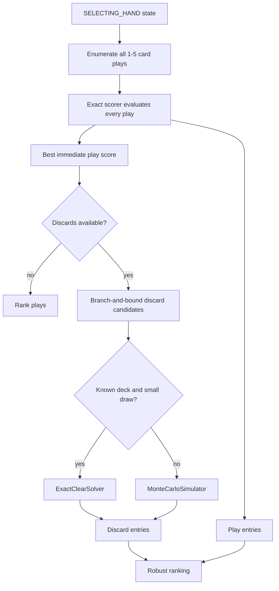
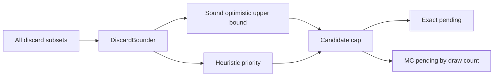
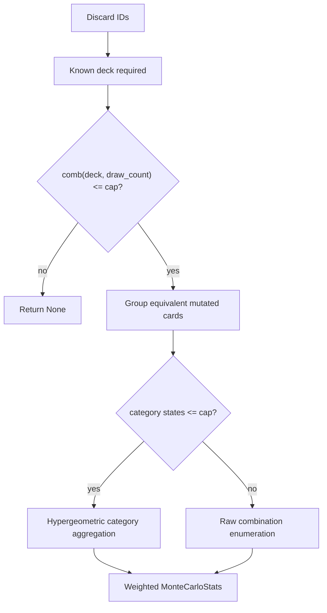
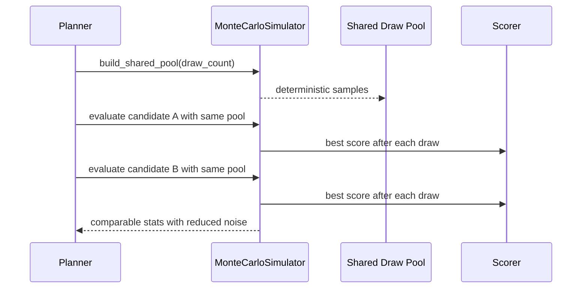
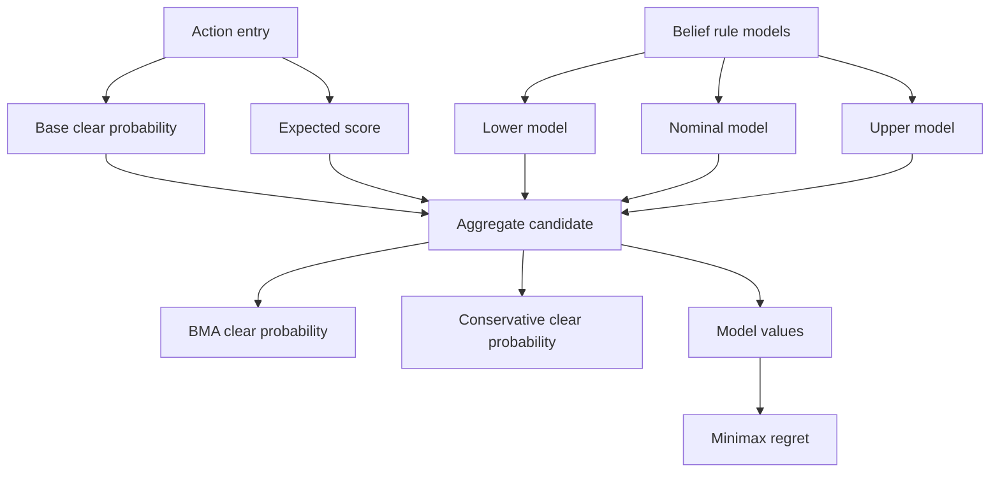
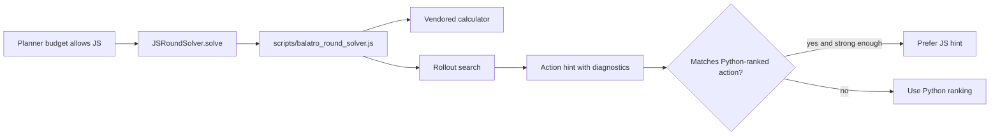

# Search Stack

The agent uses layered search. Cheap exact play scoring is always evaluated. Discard search escalates from bounded candidate generation to exact enumeration when possible, then deterministic shared-pool Monte Carlo when exact solving is too expensive.

## Search Overview

## Discard Candidate Funnel

## Exact Discard Solver

## Shared-Pool Monte Carlo

## Robust Ranking

## Optional JavaScript Solver

The latest audit fixed the JS solver boss flag path so it reads `blind.boss_modifier` as well as `blind.name` before enabling The Flint or The Eye behavior.

