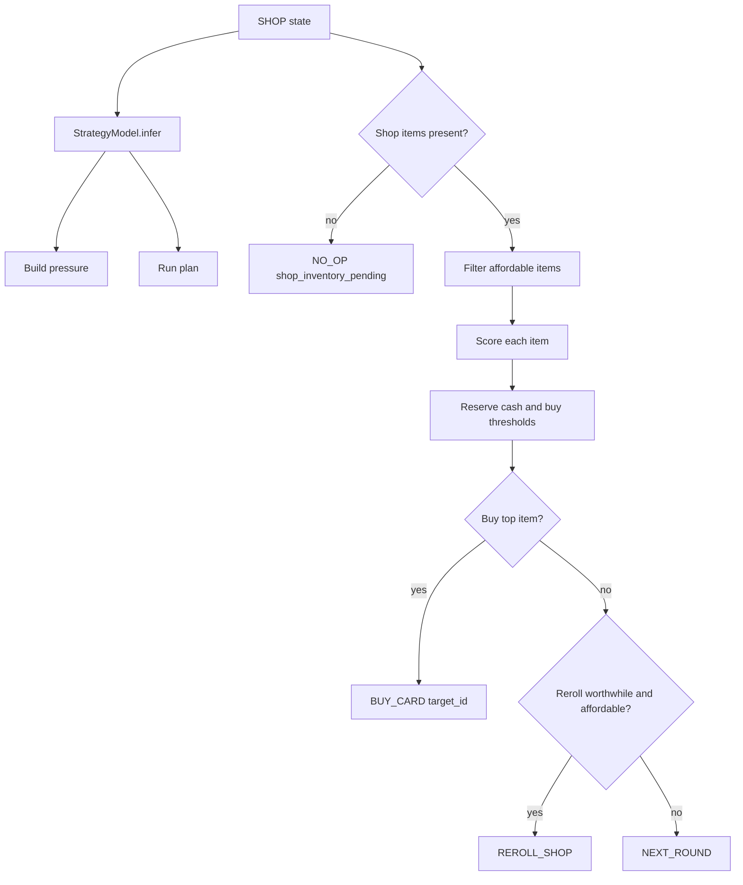
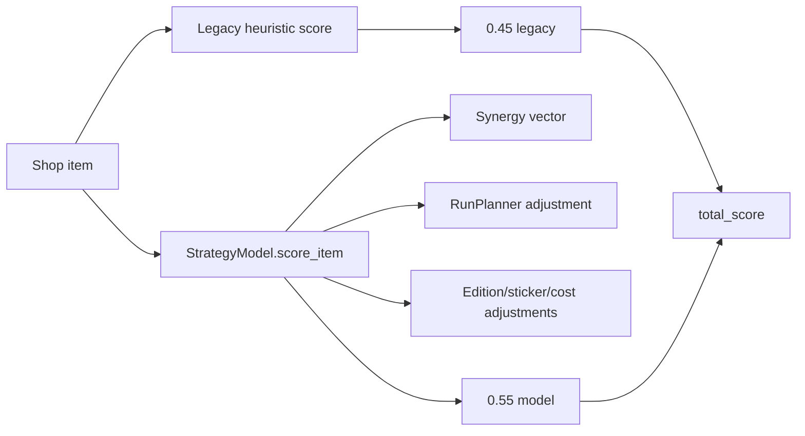
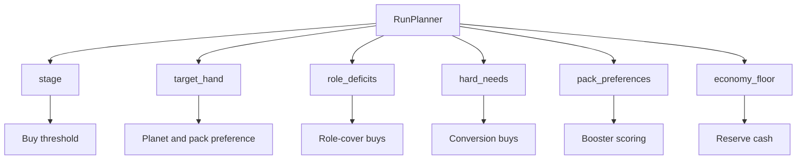
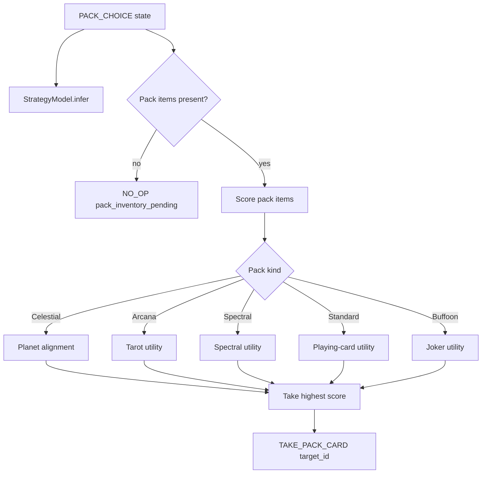
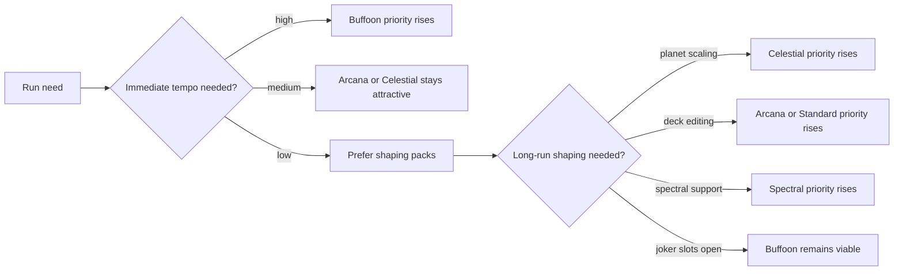

# Shop and Pack Planning

The shop and pack planners use the same strategic context as the hand planner, but their action spaces are different: buy, reroll, leave, or select a pack item.

## Shop Flow

## Item Score Blend

## Run Plan Influence

## Pack Choice Flow

## Booster Preference Map

The code computes preferences from stage, target hand, deck flags, and deck-specific blueprints.
