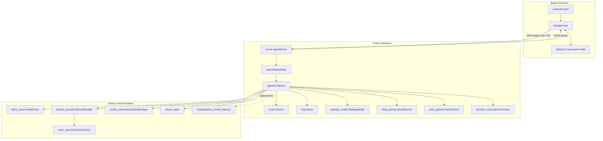
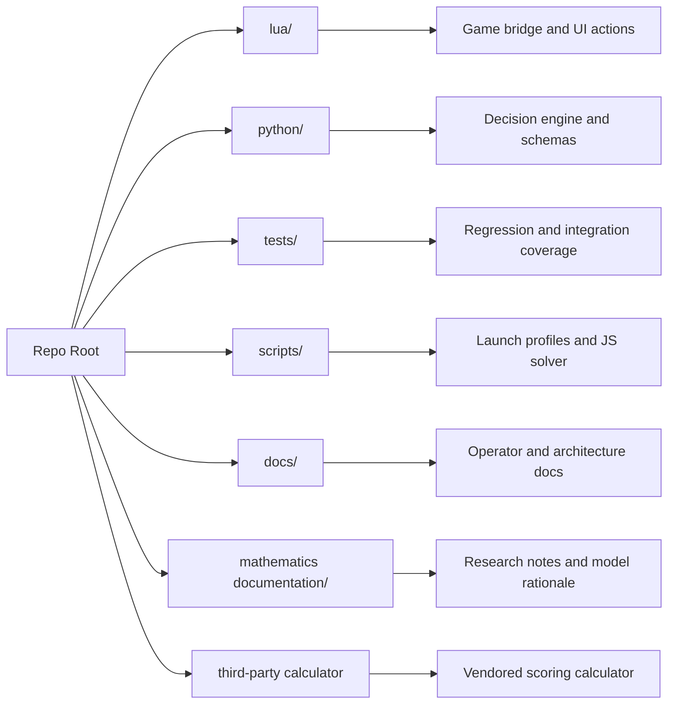
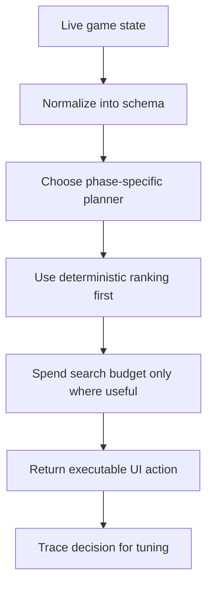

# System Architecture

The project is a mod-assisted Balatro agent. The Lua side observes and acts in the game; the Python side decides what to do; the optional JavaScript solver provides an additional high-fidelity search hint for difficult hand states.

## Component Map

## Repository Ownership

## Runtime Boundaries

| Boundary | Producer | Consumer | Format |
| --- | --- | --- | --- |
| Game state snapshot | `lua/agent.lua` | `python/server.py` | JSON line |
| Action response | `python/planner.py` | `lua/agent.lua` | JSON line |
| Decision trace | `python/decision_trace.py` | developer/operator | JSONL |
| JS solver hint | `python/js_solver.py` | `python/planner.py` | JSON stdout |
| Tests | `tests/` | pytest | deterministic fixtures |

## Design Intent

The system favors deterministic, inspectable decisions. Search is bounded by time budgets, and stochastic components use state-derived seeds so repeated states reproduce the same action.

