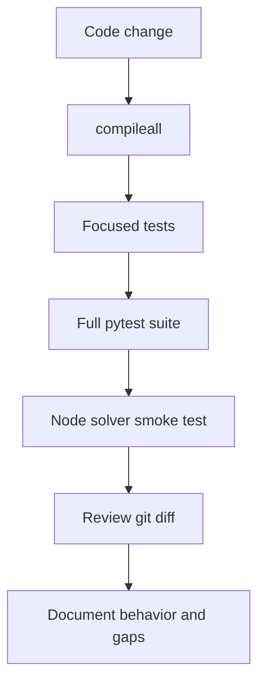
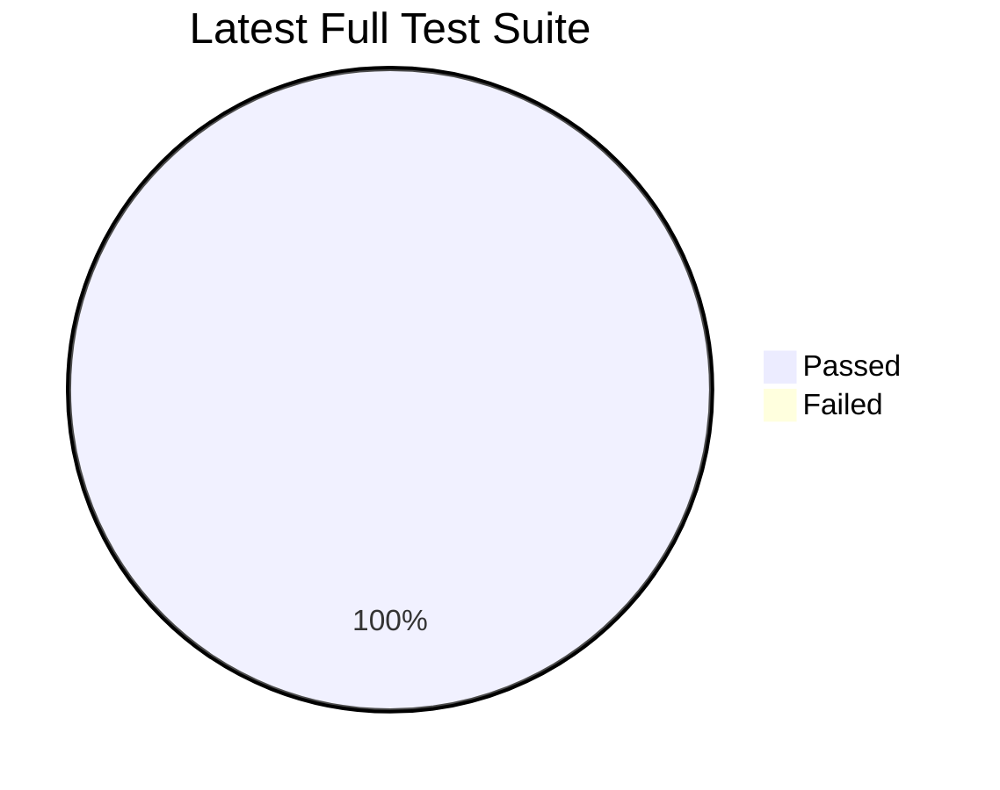
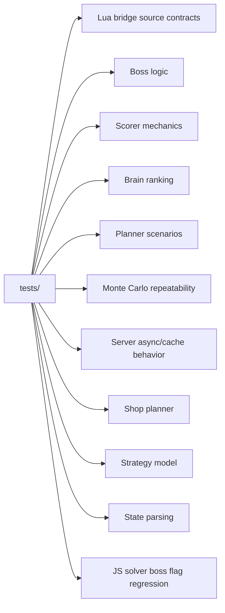
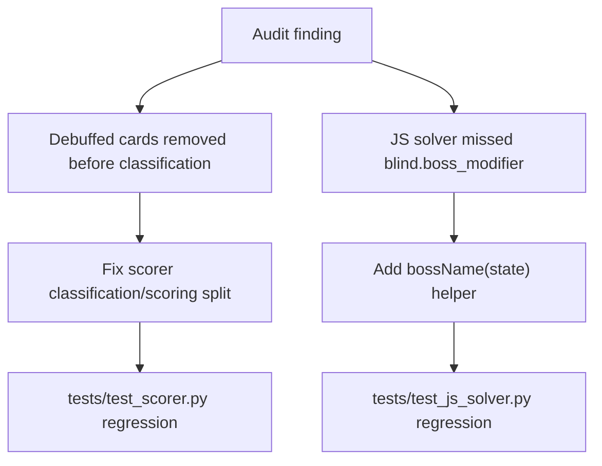
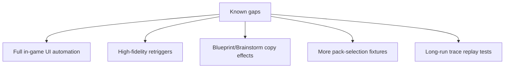
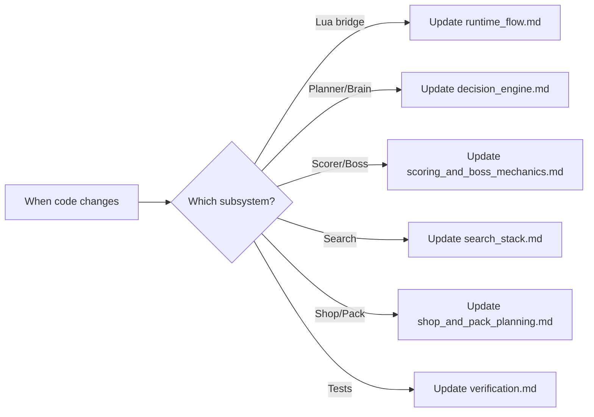

# Verification

The current verification story is mostly deterministic Python tests plus a JavaScript solver smoke check. The latest full run passed after the audit fixes.

## Verification Pipeline



## Latest Audit Result



Commands run:

```powershell
python -m compileall -q python tests
python -m pytest
Get-Content examples\sample_playable.json | node scripts\balatro_round_solver.js --samples 8 --beam 6
```

Result:

```text
74 passed
```

## Test Coverage Map



## Audit Fixes Covered



## Remaining Test Gaps



These are not current blockers, but they are the next useful places to add coverage as mechanics support grows.

## Documentation Maintenance Checklist



