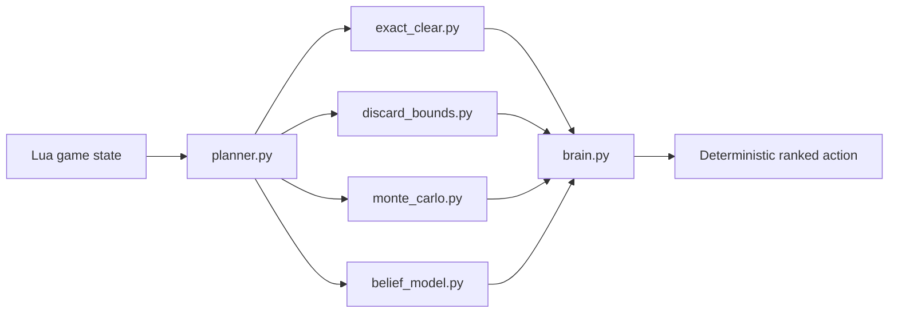
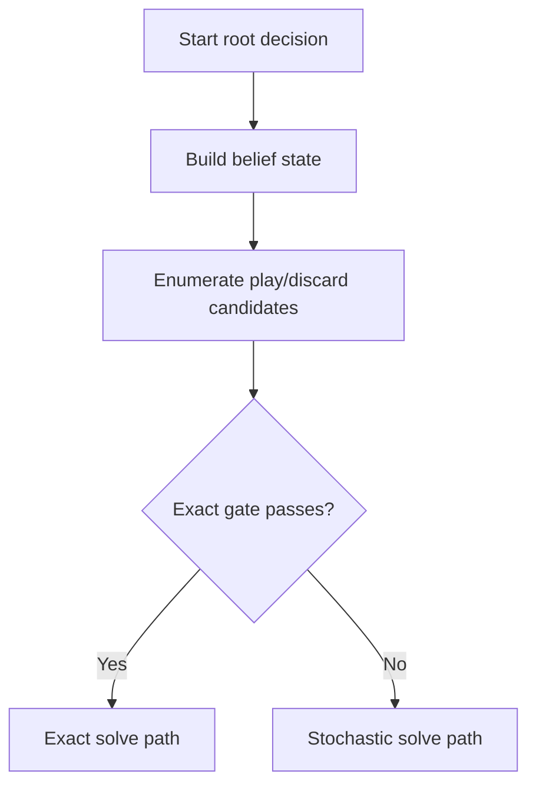
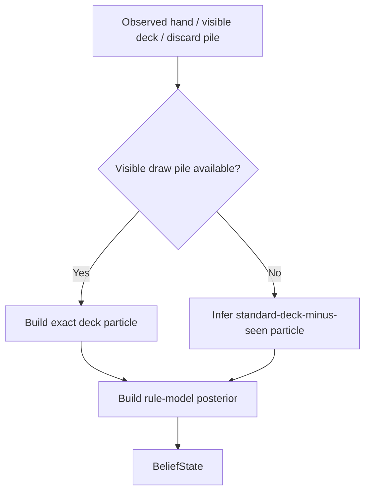
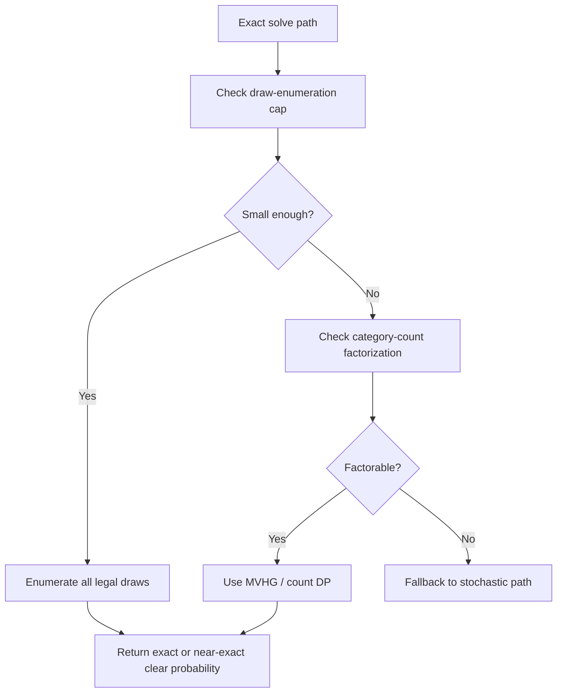
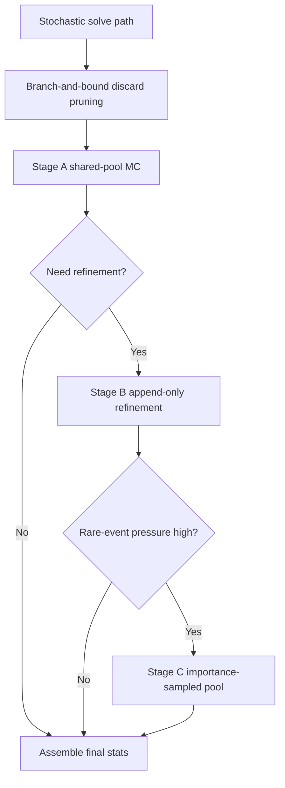
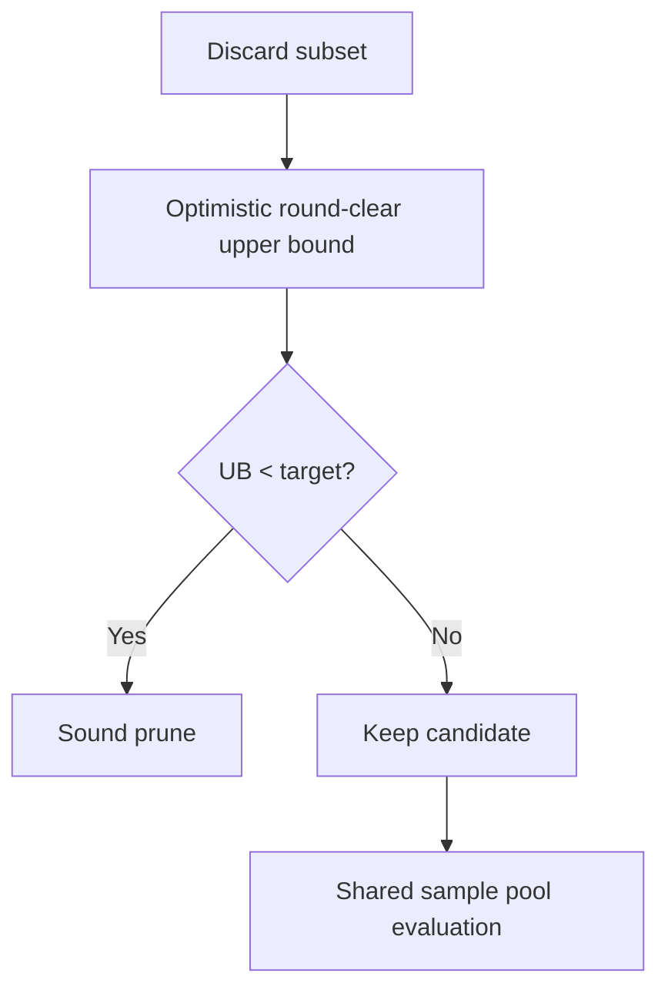
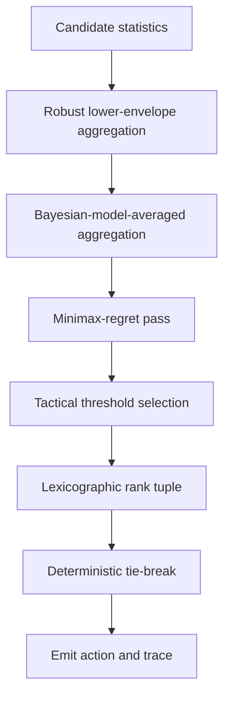

# Deterministic Brain-Layer Research For Balatro

## Executive Summary

The strongest practical upgrade for this repository is not "more Monte Carlo" by itself. It is a deterministic, risk-first planner that:

1. Maximizes conservative `P(clear current blind)` first.
2. Uses exact combinatorics whenever the state is small enough.
3. Falls back to deterministic Monte Carlo with shared sample pools, variance reduction, and hard runtime gates.
4. Treats unknown deck composition and partially implemented Joker rules as model uncertainty, not as noise to ignore.
5. Preserves the current Lua mod, Python IPC, state schema, seeded RNG, and anytime runtime budget.

For the existing codebase, the implemented target architecture is:

- `brain.py`: become a risk-aware ranking and tactical-threshold module instead of a simple linear utility layer.
- `planner.py`: route each root decision through `exact -> branch-and-bound -> deterministic MC -> robust ranking`.
- `monte_carlo.py`: keep seeded rollouts, but add shared sample pools, belief-conditioned sampling, importance sampling, control variates, and explicit confidence accounting.
- helper modules: add small, focused helpers for exact clear probability, belief modeling, discard bounds, and risk metrics.

This does not prove globally optimal play for "any deck, any difficulty" in the full Balatro game, because:

- the full game is partially observed,
- shop outcomes and future draws are stochastic,
- many Joker interactions are still only partially specified in this repository.

What it does provide is the best deterministic brain-layer path that is mathematically defensible, integrates cleanly with the current code, and is capable of converging toward very high win rates once scorer coverage is expanded and calibrated from logs.

## Implementation Status In This Repository

The brain-layer architecture in this document is now partially implemented in the runtime:

- `python/risk_metrics.py` implements lower-quantile, CVaR-style loss, Wilson-style lower confidence bounds, ESS, and normalization helpers.
- `python/belief_model.py` builds a deterministic belief state over the remaining deck and partially specified Joker-rule models.
- `python/exact_clear.py` provides exact small-state discard evaluation by exhaustive draw enumeration.
- `python/discard_bounds.py` provides branch-and-bound candidate generation with optimistic round-clear upper bounds and memoization.
- `python/monte_carlo.py` now uses deterministic shared sample pools, mixture proposals, ESS tracking, confidence bounds, and a control-variate path.
- `python/brain.py` now ranks actions lexicographically with conservative clear probability first and explicit tactical thresholds.
- `python/planner.py` now routes root decisions through exact play scoring, exact discard solving where feasible, branch-and-bound pruning, deterministic Monte Carlo refinement, and robust ranking.

What remains approximate:

- Joker scoring coverage in `python/scorer.py` is still incomplete, so robust rule models remain important.
- Exact DP across the full round horizon is still approximated by exact small-draw solving plus bounded stochastic refinement.
- The belief model currently uses a compact deterministic posterior rather than a large particle bank.

### Implementation Map



## Official Mechanics That Matter For Planning

The official Balatro FAQ says a run progresses through three rounds per Ante: Small Blind, Big Blind, and Boss Blind, and Ante 8 ends with a special Boss Blind. The Steam store page describes the campaign as having 8 difficulties. The official May 1, 2024 balance patch changed high-stake behavior in ways that materially affect planning:

- Orange Stake replaced increasing pack cost with a 30% chance for Jokers to be `Perishable`.
- Gold Stake replaced `-1 hand size` with a 30% chance for Jokers to be `Rental`.
- The first shop in every run always includes a normal Buffoon pack.
- Upcoming blinds/tags are visible immediately after defeating a boss blind.

These official changes imply that:

- survival probability is stake-sensitive,
- shop policy changes win probability materially,
- Joker durability uncertainty must be modeled explicitly at Orange/Gold stake,
- preserving strong hands and money is only rational after conservative clear probability is already high.

Sources:

- [Balatro FAQ](https://www.playbalatro.com/faq)
- [Balatro Steam page](https://store.steampowered.com/app/2379780/Balatro/)
- [Steam announcements feed for Balatro 1.0.1f patch notes](https://store.steampowered.com/news/posts/?enddate=1714582119&feed=steam_community_announcements)

## Design Goal

Let `s` be the latent full game state, `b(s)` the current belief over possible latent states, `a` a candidate action, and `pi` the continuation policy induced by the planner.

The root objective should be:

Choose action $a$ that maximizes the lexicographic objective:

$$
a^* =
\operatorname*{argmax}_{a \in \mathcal{A}(b)}
\operatorname{Lex}\left(
P_{\text{clear}}^{\text{cons}}(a),
P_{\text{clear}}^{\text{BMA}}(a),
Q_{\alpha}(a),
EV_{\text{longrun}}(a),
R_{\text{resource}}(a),
\operatorname{TieBreak}(a)
\right).
$$

where:

- `Pclear_cons(a)` is a conservative lower-confidence estimate of clear probability under model uncertainty,
- `Pclear_bma(a)` is the Bayesian-model-averaged clear probability,
- `Q_alpha(a)` is a lower-tail score statistic such as a score quantile or CVaR-derived value,
- `EV_longrun(a)` is continuation value beyond the current hand,
- `Resource(a)` rewards keeping hands, discards, money, joker durability, and hand-shaping flexibility,
- `TieBreak(a)` is deterministic and stable.

This is intentionally not a single scalar utility at the top level. A scalar utility can still be used inside subroutines, but the final root ranking should be lexicographic or epsilon-lexicographic because the user preference is explicit:

$$
P(\text{clear}) \succ EV_{\text{longrun}} \succ R_{\text{resource}}.
$$

## Existing Repository Fit

The current planner already has the correct control points:

- `python/brain.py` already defines tactical modes and `ActionFeatures`.
- `python/planner.py` already has exact immediate play enumeration, discard candidate generation, and time-aware staged search.
- `python/monte_carlo.py` already has seeded rollouts and common-root seeding.
- `python/config.py` already exposes time budgets and rollout settings.

The recommended changes are therefore brain-layer upgrades, not a rewrite.

## 1. Exact Clear Probability Engine

### 1.1 When Exact Is Feasible

Use exact methods whenever any of the following is true:

1. The draw count `k` is small and `C(N, k)` is below a hard cap.
2. The event "clear blind after this discard/play" can be expressed in terms of category counts.
3. The remaining horizon is short and the compressed state space is small enough for memoized recursion.

Recommended exact gate:

```python
if comb(remaining_deck_size, draw_count) <= EXACT_DRAW_ENUM_CAP:
    exact by exhaustive next-draw enumeration
elif compressed_state_count <= EXACT_STATE_CAP:
    exact by DP / memoized recursion
elif category_count <= EXACT_CATEGORY_CAP and joker_model_is_factorable:
    exact by multivariate-hypergeometric aggregation
else:
    stochastic path
```

Suggested defaults:

- `EXACT_DRAW_ENUM_CAP = 40_000`
- `EXACT_STATE_CAP = 150_000`
- `EXACT_CATEGORY_CAP = 14`

### 1.2 Exact One-Step Draw Probability

If after discarding `k` cards we draw `k` cards without replacement from a remaining deck with category counts `K_1, ..., K_r`, and the draw outcome is summarized by category counts `x_1, ..., x_r`, then:

Multivariate-hypergeometric draw law:

$$
\Pr(X=x)
=
\frac{\prod_{i=1}^{r} {K_i \choose x_i}}
{{N \choose k}}.
$$

subject to:

$$
\sum_{i=1}^{r} x_i = k,
\qquad
0 \le x_i \le K_i.
$$

This is the multivariate hypergeometric law.

Use it when the score or clear event depends only on count features such as:

- suit totals for flush-like events,
- rank multiplicities for pair/trips/full house/quads,
- rank-neighborhood occupancy for straight-completion abstractions,
- joker trigger counts when the joker effect depends only on category totals.

### 1.3 Exact Multi-Step Clear Probability

For current-round planning, define:

- `h`: hands left after current action,
- `d`: discards left after current action,
- `r`: remaining score to target.

For known deck and fixed rule model:

Finite-horizon blind-clear recursion:

$$
V(s,h,d,r)
=
\max_{a \in \mathcal{A}(s,h,d)}
\sum_{o \in \Omega(a)}
\Pr(o \mid s,a)\,
V(T(s,a,o),h',d',r').
$$

with terminal conditions:

$$
V(s,h,d,r \le 0)=1,
\qquad
V(s,0,d,r>0)=0.
$$

This is exact finite-horizon dynamic programming on the current blind.

### 1.4 State Compression For Exact DP

Do not memoize raw card identities. Memoize compressed sufficient statistics:

- rank multiplicity histogram,
- suit histogram,
- kept-card feature counts,
- remaining deck category counts,
- hands/discards left,
- blind score remaining bucket,
- joker rule-model identifier,
- relevant hand levels.

Compression should be rule-aware. If the current Joker set only cares about face cards and held Steel cards, then the memoization key should preserve those counts exactly and collapse irrelevant identity detail.

### 1.5 Exact Upper Bounds For Branch-And-Bound

Exact or optimistic-yet-sound upper bounds are essential:

- `UB_immediate_score`: best possible score achievable after drawing the best legal `k` cards from the remaining deck.
- `UB_flush`: impossible if kept suit count plus remaining suit availability cannot reach required suit size.
- `UB_straight`: impossible if no rank window can be completed even with best possible draws.
- `UB_multiplicity`: impossible if remaining copies cannot form pair/trips/full-house/quads targets.
- `UB_round_clear`: optimistic score accumulation over remaining hands under relaxed best-case draws.

If `UB_round_clear < target_remaining`, prune the branch soundly.

## 2. Belief-State Layer For Unknown Deck / Unknown Rules

Balatro is not always fully observed from the current mod state:

- the future deck order is unknown,
- the remaining deck may be only partially known,
- some Joker behavior in this repository is incomplete or ambiguous.

That makes the planner a belief-state controller.

### 2.1 Belief State

Represent belief as:

```python
@dataclass(frozen=True)
class BeliefState:
    deck_particles: tuple["DeckParticle", ...]
    rule_models: tuple["RulePosterior", ...]
    posterior_entropy: float
```

with:

```python
@dataclass(frozen=True)
class DeckParticle:
    category_counts: tuple[int, ...]
    weight: float

@dataclass(frozen=True)
class RulePosterior:
    model_id: str
    weight: float
    optimism_class: str  # "lower", "nominal", "upper"
```

### 2.2 Belief Update

Given observation `o` after action `a`, update:

Belief update:

$$
b'(s')
\propto
O(o \mid s',a)
\sum_{s \in \mathcal{S}}
T(s,a,s')\,b(s).
$$

Operationally in this codebase:

- observed draws collapse deck particles inconsistent with revealed cards,
- observed Joker behavior updates the posterior over ambiguous rule models,
- shop offers update priors on future shop pools only if that information is exposed by the game state.

### 2.3 Bayesian Model Averaging

For unknown deck/rule models, estimate action value with Bayesian model averaging:

Bayesian model averaging:

$$
Q_{\text{BMA}}(a)
=
\sum_{m \in \mathcal{M}} w_m
\sum_{d \in \mathcal{D}} w_d\,
Q(a \mid d,m).
$$

This is the default "best estimate" value used for mean planning and long-run EV.

### 2.4 Robust MDP / Worst-Case Envelope

To avoid fragile action selection under unknown rules, also compute:

Robust lower envelope:

$$
Q_{\text{rob}}(a)
=
\min_{m \in U_m,\ d \in U_d}
Q(a \mid d,m).
$$

where `U_m` and `U_d` are ambiguity sets built from:

- posterior credible intervals,
- known unimplemented Joker branches,
- incomplete deck visibility.

Practical recommendation:

- use `Q_rob` for `Pclear_cons`,
- use `Q_bma` for `Pclear_mean` and continuation EV.

This is directly motivated by robust dynamic programming results showing that robust recursions can be solved with nearly the same complexity as nominal dynamic programming when uncertainty sets are rectangular.

### 2.5 Minimax Regret

For model ambiguity that is not naturally worst-case in a maximin sense, use minimax regret:

Model-specific regret:

$$
\operatorname{Regret}(a,m,d)
=
V^*(m,d)-Q(a \mid m,d).
$$

Minimax regret:

$$
MR(a)
=
\max_{m,d}\operatorname{Regret}(a,m,d).
$$

Then use regret as a secondary discriminator among actions with similar conservative clear probability. This is especially useful when two actions have similar `Pclear_cons` but one becomes much worse if a partially modeled Joker behaves differently.

## 3. Deterministic Monte Carlo Upgrade

The current simulator already seeds by root state. Keep that, but make the estimator substantially stronger.

### 3.1 Shared Sample Pools

At a single decision root:

1. Build a deterministic ordered candidate list.
2. Generate one shared pool of deck particles and draw sequences.
3. Score every candidate on the exact same sampled worlds.

This is common random numbers applied correctly to action comparison. It reduces the variance of differences between actions, which is what ranking actually uses.

### 3.2 Deterministic Candidate Order

Before any rollout:

- sort candidates by a deterministic structural key,
- never iterate over Python `set` or `dict` insertion order for candidate generation,
- never allow candidate evaluation order to affect which worlds get sampled.

Required stable candidate key:

`(action_type, cards_used, sorted_card_ids, structural_signature)`

### 3.3 Inferred-Deck Sampling

When the full deck is unknown, sample from a posterior over remaining deck compositions rather than from a fresh 52-card approximation.

Recommended process:

1. Start from exact visible deck if provided.
2. If not, subtract all seen cards and sampled transformed cards from the legal deck family.
3. Generate weighted deck particles consistent with:
   - current hand,
   - discard pile,
   - revealed modified cards,
   - deck modifier constraints if known,
   - stake/shop-derived card-generation constraints if exposed.

### 3.4 Rollout Caps And Successive Refinement

Use three deterministic stages:

1. Stage A: all surviving candidates get `N0` shared-pool rollouts.
2. Stage B: only candidates within confidence / regret bands get `N1` more rollouts.
3. Stage C: only top `K` risk-relevant candidates get `N2` rare-event refinement.

Recommended defaults:

- `N0 = 12`
- `N1 = 24`
- `N2 = 48`
- `K = 3`

All samples are append-only. Never resample from scratch in later stages.

### 3.5 Importance Sampling

Plain Monte Carlo is weakest exactly where this planner most needs accuracy: small clear probabilities near the failure boundary.

Use a defensive mixture proposal:

Mixture proposal:

$$
q(x)
=
(1-\varepsilon)p(x)
+ \varepsilon q_{\text{tilt}}(x).
$$

where:

- `p` is the nominal posterior draw law,
- `q_tilt` oversamples "swing" draws: outs that complete lethal hands, suit-completion draws, rank-completion draws, or high-impact joker triggers.

Estimator:

Importance-sampling estimator:

$$
\widehat{\mu}_{\text{IS}}
=
\frac{1}{n}\sum_{i=1}^{n} w_i f(X_i),
\qquad
w_i=\frac{p(X_i)}{q(X_i)}.
$$

Use importance sampling only when nominal `Pclear` is below a threshold like `0.25` or when the target is far above mean score.

Effective sample-size diagnostic:

$$
ESS
=
\frac{\left(\sum_i w_i\right)^2}{\sum_i w_i^2}.
$$

Recommendations:

- log `ESS`,
- if `ESS / n` is too low, fall back to nominal shared-pool ranking for safety.

### 3.6 Conditioning / Rao-Blackwellization

Whenever part of the rollout can be integrated analytically, sample the harder part only and average out the rest.

Examples that fit Balatro well:

- condition on rank/suit category counts and average over irrelevant card identities,
- condition on "outs count" to exact hand classes,
- condition on whether a draw enters a strategic bucket such as "completes flush", "opens straight", "creates pair/trips".

This reduces variance and often lowers the dimensionality of the stochastic component.

### 3.7 Control Variates

Use cheap surrogates `h_j(X)` with known or exactly computed expectations.

Regression control-variate estimator:

$$
\widehat{\mu}_{\text{CV}}
=
\widehat{\mu}
-
\widehat{\beta}^{\mathsf{T}}
\left(\overline{h}-\mathbb{E}[h]\right).
$$

Choose controls such as:

- exact hypergeometric probability of drawing at least `t` cards of target suit,
- exact probability of hitting at least one of a set of rank outs,
- relaxed upper-bound score under suit/rank-only scorer,
- exact best immediate hand score ignoring unresolved Joker branches.

Only apply a control variate if:

- its expectation is known exactly or near-exactly,
- correlation with the expensive rollout payoff is high,
- its evaluation is much cheaper than a full rollout.

## 4. Branch-And-Bound Discard Solver

The current code enumerates discard subsets and samples them. That is acceptable for small hands, but it is still too blunt once exact recursion and refined MC are added.

### 4.1 Search Node

```python
@dataclass(frozen=True)
class DiscardNode:
    kept_ids: tuple[str, ...]
    discarded_ids: tuple[str, ...]
    remaining_draws: int
    bound_score_upper: float
    bound_clear_upper: float
```

### 4.2 Bound Types

- Sound bound:
  - if violated, prune with proof.
- Heuristic bound:
  - if violated, prune for runtime only and log it as heuristic.

### 4.3 Recommended Pruning Heuristics

| Heuristic | Bound type | Prune condition | Sound? | Notes |
| --- | --- | --- | --- | --- |
| Round-clear impossibility | optimistic score bound | `UB_round_clear < target_remaining` | Yes | Most important prune |
| Flush impossibility | suit availability bound | no suit can reach needed count | Yes | Very cheap |
| Straight impossibility | rank-window bound | no rank window can reach required occupancy | Yes | Needs ace-high/ace-low handling |
| Multiplicity impossibility | copy-count bound | remaining copies cannot reach pair/trips/full-house/quads | Yes | Cheap |
| Dominated discard size | structural dominance | same keep core but larger discard has worse UB | Usually | Treat as heuristic unless proved |
| Confidence elimination | statistical band | action cannot catch incumbent within CI | No | Runtime heuristic only |
| Rule-ambiguity elimination | robust lower envelope | candidate loses under all rule models | Yes if envelope exact | Very useful with incomplete jokers |

### 4.4 Memoization

Memoize by compressed sufficient statistics, not card IDs:

```python
MemoKey = tuple[
    tuple[int, ...],  # deck category counts
    tuple[int, ...],  # kept category counts
    int,              # hands_left
    int,              # discards_left
    int,              # score_remaining_bucket
    str,              # rule_model_id
]
```

Store:

- exact clear probability if exact branch was solved,
- lower/upper bounds if only bounded,
- rollout statistics if stochastic branch was evaluated.

## 5. Risk Metrics And Utility

### 5.1 Tail-Risk Metrics

A good brain layer should not rank actions on mean score alone.

Use at least:

- `Pclear`
- `Q_alpha(score)` for a small `alpha` such as `0.10`
- `CVaR_alpha(loss)` where `loss = max(0, target_remaining - score)`

From Rockafellar and Uryasev:

CVaR identity:

$$
\operatorname{CVaR}_{\beta}(X)
=
\min_{\alpha} F_{\beta}(X,\alpha).
$$

with

$$
F_{\beta}(X,\alpha)
=
\alpha
+
(1-\beta)^{-1}
\mathbb{E}\left[(L(X,Y)-\alpha)^+\right].
$$

For this codebase, `CVaR` is best used as a lower-tail continuation measure, not as the primary objective. The primary objective remains clear probability.

### 5.2 Overkill

Overkill is not always bad. It is bad only when conservative clear probability is already high and the overkill consumes meaningful future resources.

Recommended definition:

$$
\operatorname{OverkillNorm}
=
\operatorname{clip}\left(
\frac{\mathbb{E}[S]-r}{\max(r,1)},
0,
1
\right).
$$

Apply a penalty only when:

- `Pclear_cons >= Gamma_safe`
- and the action uses more cards, money, or discard flexibility than an alternative within the same clear-probability band.

### 5.3 Card Efficiency

Define:

$$
\operatorname{CardEfficiency}
=
\frac{\mathbb{E}[S]}{\max(c_{\text{used}},1)}.
$$

Use this as a tertiary ranking feature only after clear probability and tail risk.

### 5.4 Resource Preservation

Resource should include:

- hands left,
- discards left,
- money,
- joker durability,
- hand-shaping flexibility,
- future shop access quality if the phase is pre-shop or post-boss.

### 5.5 Final Root Rank Tuple

Recommended normalized deterministic rank tuple:

```python
rank_tuple = (
    round(p_clear_lcb, 8),
    round(p_clear_bma, 8),
    round(-minimax_regret_norm, 8),
    round(q10_score_norm, 8),
    round(ev_longrun_norm, 8),
    round(resource_norm, 8),
    round(-overkill_norm, 8),
    round(card_efficiency_norm, 8),
    action_type_priority,
    tuple(sorted(card_ids)),
)
```

Sort descending except for the already negated terms.

This preserves determinism and enforces the requested priority ordering.

## 6. Formal Tactical Thresholds

Replace the current hand-built mode logic with thresholds derived from a target confidence level.

Define:

- `Gamma_base = 0.94`
- `Gamma_target = clip(Gamma_base + 0.02 * I(boss) + 0.01 * I(stake >= 5) + 0.01 * I(hands_left <= 2), 0.94, 0.99)`
- `Gamma_scale = clip(Gamma_target + 0.02, 0.96, 0.995)`
- `Gamma_panic = max(0.35, Gamma_target - 0.40)`

Then:

- `LETHAL`
  - an exact immediate play clears the blind, or exact lower bound is `1.0`.
- `SAFE_CLEAR`
  - best candidate has `Pclear_cons >= Gamma_target`.
- `SCALING_PRESERVE`
  - best candidate has `Pclear_cons >= Gamma_scale` and a strictly better resource score than the greedy lethal line.
- `DESPERATION`
  - best candidate has `Pclear_cons < Gamma_target`.
- `PANIC`
  - best candidate has `Pclear_cons < Gamma_panic` or all sound upper bounds show no safe line.

The main point is not the exact constants. The main point is:

- the thresholds are explicit,
- stake and boss pressure shift them,
- they operate on conservative clear probability, not raw expected score.

## 7. Method Selection Table

| Method | Use when | Returns | Deterministic | Runtime profile | Main risk |
| --- | --- | --- | --- | --- | --- |
| Exact exhaustive draw enumeration | `C(N, k)` is small | exact `Pclear`, exact score distribution | Yes | Expensive but predictable | state blow-up |
| Exact category DP / MVHG | event depends on category counts | exact or near-exact `Pclear` | Yes | Very strong for flush/pair/straight buckets | abstraction mismatch |
| Shared-pool MC | exact infeasible but belief reasonably known | low-variance comparative estimates | Yes | Best default fallback | weak on rare clears |
| Importance-sampled MC | nominal clear is rare or tail estimate unstable | better tail / `Pclear` estimates | Yes | Medium-high | weight degeneracy |
| Conditioning + control variates | cheap exact surrogates exist | lower-variance mean and tail estimates | Yes | Excellent when available | bad controls can waste time |
| Robust lower envelope | rule model or deck ambiguity large | safe lower bound | Yes | Cheap-medium | conservatism |
| Minimax regret | multiple plausible models remain | ambiguity-sensitive discriminator | Yes | Medium | requires candidate-optimal baselines |

## 8. Recommended Rollout Budget Timeline

### 8.1 Budget Phases

```mermaid
gantt
title Selecting-Hand Budget (example 4500 ms profile)
dateFormat X
axisFormat %L ms
section Root setup
State normalization and belief build :a1, 0, 180
Exact immediate plays and exact gate :a2, 180, 420
section Search
Branch-and-bound discard generation :a3, 600, 700
Shared-pool MC stage A :a4, 1300, 1100
Targeted stage B refinement :a5, 2400, 900
Rare-event IS / CVaR refinement :a6, 3300, 700
section Finalize
Robust ranking and tie-break :a7, 4000, 250
Trace/log emission :a8, 4250, 150
```



Recommended hard policy:

- if exact gate succeeds early, skip stochastic stages,
- if budget pressure is high, skip stage C before reducing stage A,
- never spend final headroom on more rollouts if ranking margins are already decisive.

## 9. Root Decision Flow

### 9.1 Method Router



### 9.1a Belief Construction



### 9.2 Exact Solve Path



### 9.3 Stochastic Solve Path



### 9.3a Discard Candidate Pruning



### 9.4 Ranking Pipeline



## 10. Implemented Code Touchpoints

### 10.1 `python/brain.py`

The runtime now centers the brain layer around risk-aware ranking and tactical thresholds. The core shape is:

```python
@dataclass
class RiskSummary:
    p_clear_lcb: float
    p_clear_bma: float
    minimax_regret: float
    q10_score: float
    cvar_loss: float
    ev_longrun: float
    resource_score: float
    overkill: float
    card_efficiency: float

@dataclass
class RankedAction:
    action_type: str
    cards: list[str]
    risk: RiskSummary
    rank_tuple: tuple
```

and functions:

```python
class Brain:
    def determine_mode(self, state: BalatroState, best: list[RankedAction]) -> str: ...
    def build_rank_tuple(self, state: BalatroState, risk: RiskSummary, action_type: str, cards: list[str]) -> tuple: ...
    def compare_actions(self, ranked_actions: list[RankedAction]) -> RankedAction: ...
```

Keep `ActionFeatures` only if needed for backward compatibility, but stop using it as the primary decision object.

### 10.2 `python/monte_carlo.py`

The runtime now adds deterministic shared-pool structures like:

```python
@dataclass(frozen=True)
class SharedSample:
    particle_id: int
    proposal_id: str
    draw_signature: tuple
    nominal_prob: float
    proposal_prob: float

@dataclass
class WeightedRolloutStats:
    mean: float
    variance: float
    q10: float
    cvar10_loss: float
    p_clear: float
    p_clear_lcb: float
    ess: float
    confidence_margin: float
```

Core methods:

```python
class MonteCarloSimulator:
    def build_shared_pool(self, state: BalatroState, belief: BeliefState, n: int, proposal: str) -> list[SharedSample]: ...
    def evaluate_candidate(self, state: BalatroState, candidate, pool: list[SharedSample], use_control_variates: bool) -> WeightedRolloutStats: ...
    def refine_candidates(self, ...): ...
```

### 10.3 `python/planner.py`

The runtime now follows this decision sequence inside `plan_selecting_hand`:

```python
belief = belief_model.from_state(state)
candidates = candidate_builder.enumerate(state)
exact_result = exact_clear.try_solve(state, belief, candidates, deadline)
if exact_result is not None:
    return exact_result

survivors = discard_bounds.prune(state, belief, candidates, deadline)
pool = mc_sim.build_shared_pool(state, belief, n=config.MC_STAGE_A_ROLLOUTS, proposal="nominal")
stats = [mc_sim.evaluate_candidate(state, c, pool, use_control_variates=True) for c in survivors]
stats = mc_sim.refine_candidates(state, belief, survivors, stats, deadline)
ranked = brain.rank_candidates(state, survivors, stats, belief)
return ranked[0].to_action_response()
```

### 10.4 `python/config.py`

The runtime now exposes brain-layer settings such as:

```python
EXACT_DRAW_ENUM_CAP
EXACT_STATE_CAP
EXACT_CATEGORY_CAP
MC_STAGE_A_ROLLOUTS
MC_STAGE_B_ROLLOUTS
MC_STAGE_C_ROLLOUTS
MC_RARE_EVENT_THRESHOLD
MC_IS_MIXTURE_EPSILON
MC_MIN_ESS_RATIO
RISK_ALPHA
REGRET_EPSILON
TACTICAL_GAMMA_BASE
TACTICAL_GAMMA_BOSS_BONUS
TACTICAL_GAMMA_HIGH_STAKE_BONUS
```

### 10.5 Helper Modules

Implemented helper files:

- `python/exact_clear.py`
- `python/belief_model.py`
- `python/discard_bounds.py`
- `python/risk_metrics.py`
- `python/robust_value.py`

These are additive and do not require IPC or schema changes.

## 11. Pseudo-Interfaces

### 11.1 Exact solver

```python
class ExactClearSolver:
    def try_solve(
        self,
        state: BalatroState,
        belief: BeliefState,
        candidates: list["CandidateAction"],
        deadline: float | None,
    ) -> "ExactSolveResult | None":
        ...
```

### 11.2 Belief model

```python
class BeliefModel:
    def from_state(self, state: BalatroState) -> BeliefState: ...
    def posterior_predictive(self, belief: BeliefState, draw_count: int, n: int, seed: int) -> list[DeckParticle]: ...
    def robust_subset(self, belief: BeliefState) -> BeliefState: ...
```

### 11.3 Candidate action

```python
@dataclass(frozen=True)
class CandidateAction:
    action_type: str
    cards: tuple[str, ...]
    cards_used: int
    structural_signature: tuple
```

### 11.4 Risk metrics

```python
def lower_quantile(samples: list[float], alpha: float) -> float: ...
def cvar_loss(samples: list[float], target: float, alpha: float) -> float: ...
def lower_confidence_bound(p_hat: float, n_eff: float, z: float = 1.96) -> float: ...
def minimax_regret(values_by_model: dict[str, float]) -> float: ...
```

### 11.5 Deterministic ranking

```python
class Brain:
    def rank_candidates(
        self,
        state: BalatroState,
        candidates: list[CandidateAction],
        stats: list[WeightedRolloutStats],
        belief: BeliefState,
    ) -> list[RankedAction]:
        ...
```

## 12. Calibration, Tests, And Logging

### 12.1 Calibration

Every predicted `Pclear` should later be compared with actual outcome.

Track:

- Brier score,
- expected calibration error,
- reliability bins for `Pclear_cons` and `Pclear_bma`,
- underconfidence / overconfidence split by stake, blind type, and archetype.

### 12.2 Tests

Minimum test suite additions:

1. Exact-vs-exhaustive:
   - toy decks where every draw can be enumerated by brute force.
2. Exact-vs-MVHG:
   - flush and pair-completion cases where category counts are sufficient.
3. MC unbiasedness:
   - deterministic shared-pool estimates converge to exact values on toy states.
4. Importance-sampling sanity:
   - weighted estimator matches exact probability on rare-event toy cases.
5. Control-variate variance reduction:
   - same seed, same budget, lower estimator variance on matched toy cases.
6. Branch-and-bound safety:
   - no sound prune removes the optimal line.
7. Determinism:
   - repeated root state produces identical ranked actions and identical trace hashes.
8. Reordering robustness:
   - candidate enumeration order changes do not change final result.

### 12.3 Logging

Each decision trace should log:

- `decision_method`: `exact`, `mvhg`, `shared_pool_mc`, `is_mc`, `robust_only`
- `root_seed`
- `belief_entropy`
- `rule_models_considered`
- `exact_gate_reason`
- `num_candidates_generated`
- `num_candidates_pruned_sound`
- `num_candidates_pruned_heuristic`
- `bound_gap_best`
- `rollouts_stage_a`, `rollouts_stage_b`, `rollouts_stage_c`
- `ess_best_candidate`
- `p_clear_lcb`
- `p_clear_bma`
- `q10_score`
- `cvar10_loss`
- `minimax_regret`
- `mode`
- `rank_tuple`
- `tie_break_key`

This is the data needed to make future tuning evidence-based instead of anecdotal.

## 13. Practical Defaults

Recommended near-term defaults for this repository:

- exact first for immediate plays,
- exact first for discards with `draw_count <= 3` and small remaining deck,
- shared-pool MC as default fallback,
- importance sampling only for `Pclear < 0.25`,
- robust lower envelope enabled whenever unresolved Joker behavior is present,
- lexicographic ranking at the root,
- CVaR alpha around `0.10`,
- no randomness in tie-breaking.

## 14. What This Means For Gold Stake

At Gold Stake, the planner should behave as follows:

- become materially more conservative when Joker durability ambiguity exists,
- prefer lines with stronger lower-tail protection, not just bigger average spikes,
- preserve money and flexible hands only after conservative clear probability is comfortably high,
- use robust envelopes when rental/perishable uncertainty can flip build quality,
- treat current-round exact clear probability as more important than speculative future scaling unless the conservative clear threshold is already satisfied.

That is the correct mathematical direction for a Gold-Stake-capable deterministic planner.

## 15. Recommended Next Extension Order

1. Add `risk_metrics.py` and replace the final root ranking in `brain.py`.
2. Add `exact_clear.py` for immediate exact and small-draw exact cases.
3. Add `discard_bounds.py` and prune before Monte Carlo.
4. Upgrade `monte_carlo.py` with shared pools, ESS, and control variates.
5. Add rule-model ambiguity handling and robust lower envelope.
6. Add minimax regret only after robust/BMA values are already logged.
7. Calibrate with replay logs before retuning thresholds.

## References

Game sources:

- [Balatro FAQ](https://www.playbalatro.com/faq)
- [Balatro Steam page](https://store.steampowered.com/app/2379780/Balatro/)
- [Steam announcements feed including Balatro 1.0.1f patch notes](https://store.steampowered.com/news/posts/?enddate=1714582119&feed=steam_community_announcements)

Primary or near-primary mathematical sources:

- [Kaelbling, Littman, Cassandra (1998), Planning and acting in partially observable stochastic domains](https://people.csail.mit.edu/lpk/papers/aij98-pomdp.pdf)
- [Pineau, Gordon, Thrun (2003), Point-based value iteration: An anytime algorithm for POMDPs](https://www.cs.cmu.edu/~ggordon/jpineau-ggordon-thrun.ijcai03.pdf)
- [Nilim and El Ghaoui (2005), Robust Control of Markov Decision Processes with Uncertain Transition Matrices](https://people.eecs.berkeley.edu/~elghaoui/Pubs/RobMDP_OR2005.pdf)
- [Iyengar (2005), Robust Dynamic Programming](https://www.researchgate.net/publication/220442530_Robust_Dynamic_Programming)
- [Regan and Boutilier (2010), Robust Policy Computation in Reward-uncertain MDPs using Nondominated Policies](https://www.cs.toronto.edu/~cebly/Papers/Regan_Boutilier_aaai10.pdf)
- [Hoeting, Madigan, Raftery, Volinsky (1999), Bayesian Model Averaging: A Tutorial](https://sites.stat.washington.edu/www/research/online/hoeting1999.pdf)
- [Rockafellar and Uryasev (2000), Optimization of Conditional Value-at-Risk](https://sites.math.washington.edu/~rtr/papers/rtr179-CVaR1.pdf)
- [Rockafellar and Uryasev (2002), Conditional Value-at-Risk for General Loss Distributions](https://sites.math.washington.edu/~rtr/papers/rtr187-CVaR2.pdf)
- [Kahn and Marshall (1953), Methods of Reducing Sample Size in Monte Carlo Computations](https://pubsonline.informs.org/doi/10.1287/opre.1.5.263)
- [Heikes, Montgomery, Rardin (1976), Using common random numbers in simulation experiments](https://journals.sagepub.com/doi/10.1177/003754977602700301)
- [Blanchet and Glynn (2008), Efficient Rare-event Simulation for the Maximum of Heavy-tailed Random Walks](https://web.stanford.edu/~glynn/papers/2008/BlanchetG08.html)
- [Stanford CS109 notes on the multivariate hypergeometric distribution](https://web.stanford.edu/class/archive/cs/cs109/cs109.1218/files/student_drive/5.8.pdf)
- [Art Owen, Variance Reduction chapter](https://artowen.su.domains/mc/Ch-var-basic.pdf)

