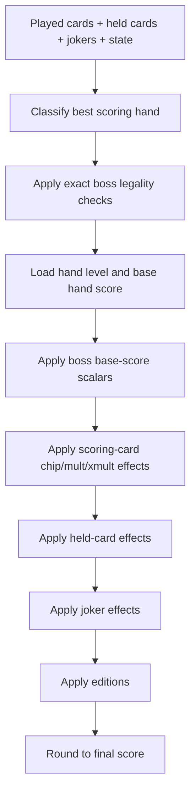
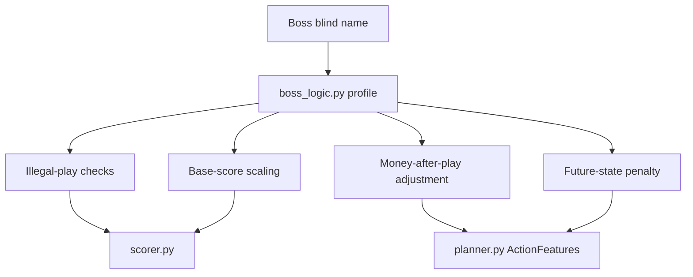
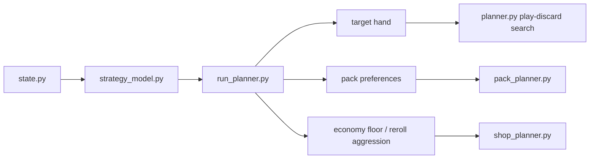
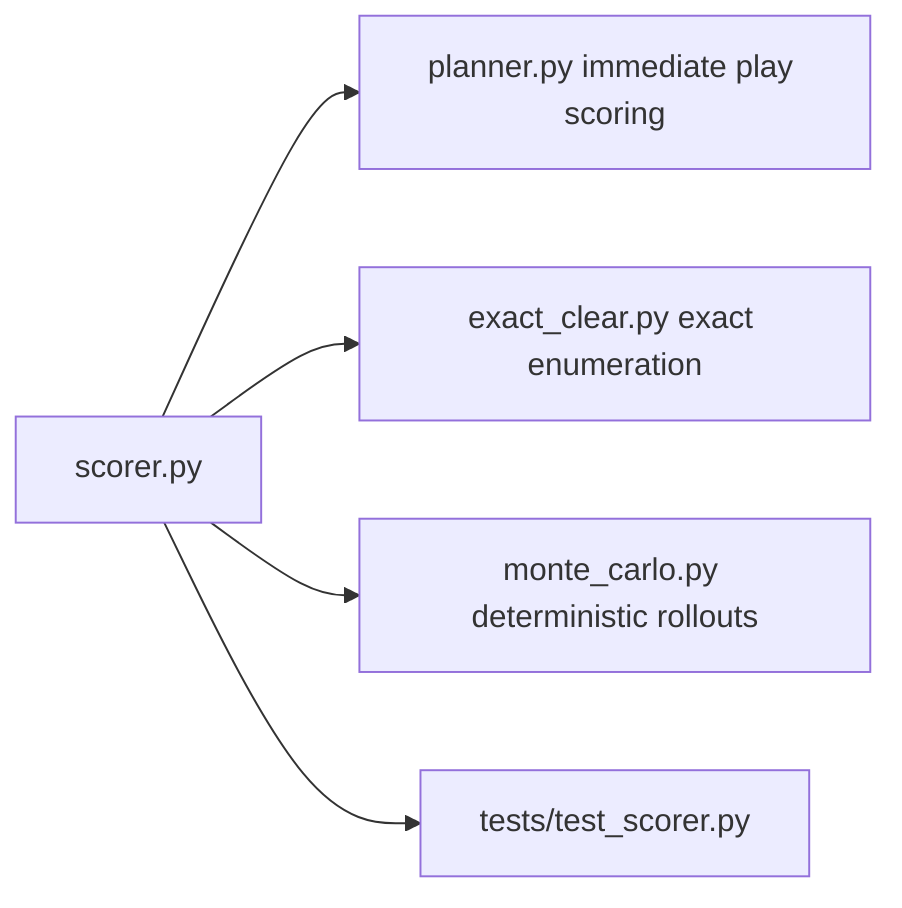
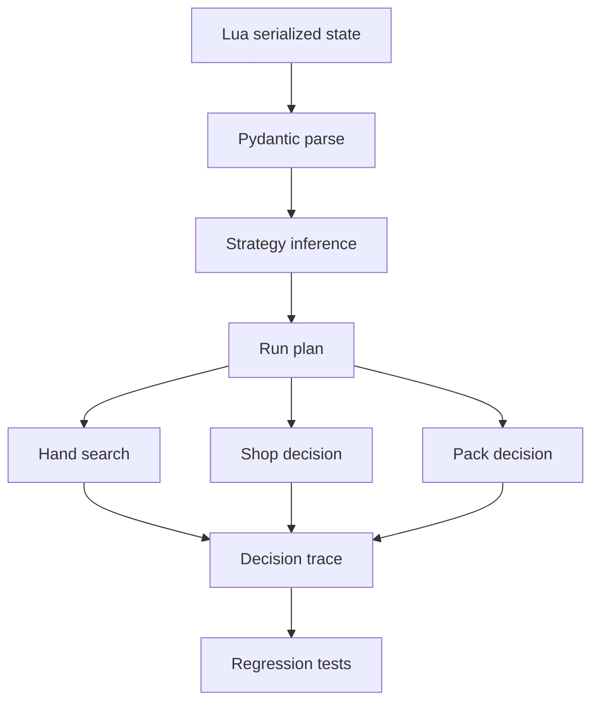

# Mechanics Completion And Integration

## Executive Summary

This repository now has a stronger connection between:

- live Balatro state from the Lua mod,
- scorer-level game mechanics,
- boss-blind restrictions,
- run-level planning,
- shop and pack decisions,
- exact and Monte Carlo hand search.

The main structural improvement is that boss restrictions now enter at the scorer layer instead of only being handled as planner heuristics. That matters because the exact solver, deterministic Monte Carlo rollouts, and root action ranking all call the same scorer.

In practical terms:

- if a hand is illegal under `The Psychic`, `The Eye`, or `The Mouth`, it scores `0`,
- if `The Flint` is active, the scorer scales the base hand chips and base hand mult directly,
- if `The Tooth` or `The Ox` is active, the planner now updates `money_after_action` accordingly,
- if a boss adds continuation risk, the planner penalizes future-hand value instead of pretending the post-play state is normal,
- if the run enters a boss that suppresses a build family, the strategy model shifts away from that family before the hand search starts.

## Primary Sources

This implementation pass was grounded in:

- the shipped Balatro game code extracted from `game.lua` in the local Lovely dump,
- the official Balatro FAQ,
- the official Steam patch notes / announcement feed.

Used local source examples:

- `The Plant` in the dumped blind table uses `debuff = {is_face = 'face'}`.
- `The Psychic` uses `debuff = {h_size_ge = 5}`.
- `Arrowhead` has `config = {extra = 50}`.
- `Onyx Agate` has `config = {extra = 7}`.
- `Bloodstone` has `config = {extra = {odds = 2, Xmult = 1.5}}`.
- `Bootstraps` has `config = {extra = {mult = 2, dollars = 5}}`.
- `Driver's License` has `config = {extra = 3}`.

## What Was Added

### Boss Logic Layer

New helper module:

- `python/boss_logic.py`

It centralizes:

- boss name normalization,
- boss profile construction,
- exact illegal-play checks,
- base-hand score scaling,
- post-play money effects,
- continuation-risk penalties.

### Scorer-Level Mechanics

Expanded in:

- `python/scorer.py`

New or strengthened mechanics:

- `The Psychic`: invalidates plays with fewer than 5 cards.
- `The Eye`: invalidates repeated hand types within the round.
- `The Mouth`: invalidates hands that do not match the already-locked hand type.
- `The Flint`: halves base hand chips and base hand mult before card additions.
- `Gros Michel`: flat mult support.
- `Bootstraps`: `mult += 2 * floor(money / 5)` using live economy.
- `Arrowhead`: suit chip bonus for played Spades.
- `Onyx Agate`: suit mult bonus for played Clubs.
- `Bloodstone`: deterministic expected-value heart xmult factor.
- `Driver's License`: active once the modified-card threshold is met.
- `Throwback`, `Vampire`, `Glass Joker`, and `Ramen`: stronger persistent xmult support through stored state.
- `Ancient Joker`: suit-based xmult if the tracked suit is available in internal state.
- `Rough Gem`: deterministic money gain estimate for planning.

### Boss-Aware Strategy And Belief

Expanded in:

- `python/strategy_model.py`
- `python/run_planner.py`
- `python/belief_model.py`
- `python/planner.py`

New effects:

- face-card plans are strongly suppressed into `The Plant`,
- lock-to-first-hand behavior is reflected in run planning for `The Mouth`,
- boss uncertainty penalties are fed into robust rule models for `Crimson Heart`, `Verdant Leaf`, `Cerulean Bell`, and `Amber Acorn`,
- post-play continuation penalties are applied for bosses like `The Hook`, `The Fish`, and `The Arm`,
- the planner's money-aware ranking now incorporates deterministic boss money effects.

## Small Mathematical Notes

### Bootstraps

The live mult bonus is:

$$
\Delta M_{\text{Bootstraps}}
=
m_{\text{step}}
\left\lfloor
\frac{\text{money}}{d_{\text{step}}}
\right\rfloor.
$$

With the shipped config:

$$
m_{\text{step}}=2,
\qquad
d_{\text{step}}=5.
$$

so:

$$
\Delta M_{\text{Bootstraps}}
=
2\left\lfloor\frac{\text{money}}{5}\right\rfloor.
$$

### The Flint

`The Flint` scales only the base hand layer, not every later additive or multiplicative effect:

$$
C_0' = 0.5 C_0,
\qquad
M_0' = 0.5 M_0.
$$

Then the normal scoring pipeline continues:

$$
S
=
\left(C_0' + \Delta C_{\text{cards}} + \Delta C_{\text{jokers}}\right)
\left(M_0' + \Delta M_{\text{cards}} + \Delta M_{\text{jokers}}\right)
\prod_{\ell} X_{\ell}.
$$

### Bloodstone

For deterministic planning, the expected xmult factor per Heart card is:

$$
\mathbb{E}[X_{\text{Bloodstone}}]
=
1+\frac{x_{\text{proc}}-1}{o}.
$$

With:

$$
x_{\text{proc}} = 1.5,
\qquad
o = 2.
$$

that becomes:

$$
\mathbb{E}[X_{\text{Bloodstone}}]
=
1+\frac{1.5-1}{2}
=
1.25.
$$

This is not the exact distributional model, but it is a stable deterministic approximation that can be used in root ranking and exact/MC consistency checks.

## Modular Flow Diagrams

### Scoring Pipeline

### Boss Enforcement

### Strategy To Search

### Shared Scorer Reuse

### Sanity Check Sweep

## Sanity Check: Logical And Structural Connectivity

The main structural invariants after this pass are:

1. The scorer is the single source of truth for boss legality.
   Exact search, deterministic Monte Carlo, and immediate play ranking all use the same `evaluate_play(...)` path.

2. The run planner is the single source of truth for strategic direction.
   Shop and pack planning both consume the same `run_plan` fields:
   - `target_hand`
   - `accepted_hands`
   - `pack_preferences`
   - `economy_floor`
   - `reroll_aggression`

3. Boss context is attached once and then reused everywhere.
   The strategy model produces `boss_profile`, and downstream layers only consume it.

4. Money-sensitive effects are no longer ignored at root ranking time.
   `money_after_action` now reflects deterministic boss penalties and some deterministic joker money effects.

5. Duplicate-heavy mutated decks are not forced into only pair/flush/straight logic.
   The run planner can now target:
   - `Three of a Kind`
   - `Full House`
   - `Four of a Kind`
   - `Five of a Kind`

## Remaining Gaps

The biggest remaining mechanic gaps are still:

- full boss handling for every showdown blind side effect,
- more complete Joker rarity-aware effects such as `Baseball Card`,
- more exact money/consumable economy transitions,
- deeper pack-use logic after a consumable is taken,
- more complete legendary / niche Joker support,
- explicit next-blind-aware shop planning when future blind metadata is available.

These are now isolated follow-up problems rather than architectural gaps.
