# Runtime Mathematical Specification

This document is the code-mapped mathematical specification for the current runtime. It is intentionally more detailed than the research notes: every major formula below maps to a concrete module in `python/` or `scripts/`.

All display equations use GitHub-safe double-dollar display blocks. Inline equations use single-dollar inline math.

## 1. Code Map

| Runtime layer | Primary files | Mathematical role |
| --- | --- | --- |
| State normalization | `python/state.py` | Converts the Lua snapshot into typed state variables. |
| Boss profile | `python/boss_logic.py` | Produces constraints, score scalars, money effects, and uncertainty penalties. |
| Hand scoring | `python/scorer.py` | Classifies hands, applies debuffs, chips, mult, xmult, editions, and joker effects. |
| Exact discard solving | `python/exact_clear.py` | Uses raw combination enumeration or multivariate hypergeometric category aggregation. |
| Monte Carlo solving | `python/monte_carlo.py` | Uses deterministic shared samples, tilted proposals, weighted statistics, ESS, Wilson lower bounds, and control variates. |
| Belief model | `python/belief_model.py` | Infers unknown deck particles and robust rule-model posteriors. |
| Robust value | `python/robust_value.py` | Builds BMA values, conservative lower envelopes, and regret inputs. |
| Tactical brain | `python/brain.py` | Chooses mode, scalar utility, and lexicographic rank tuple. |
| Planner | `python/planner.py` | Joins exact play scoring, discard search, Monte Carlo refinement, robust ranking, and JS arbitration. |
| Strategy, shop, packs | `python/strategy_model.py`, `python/run_planner.py`, `python/shop_planner.py`, `python/pack_planner.py` | Infers build archetype, run plan, item value, and pack choice. |

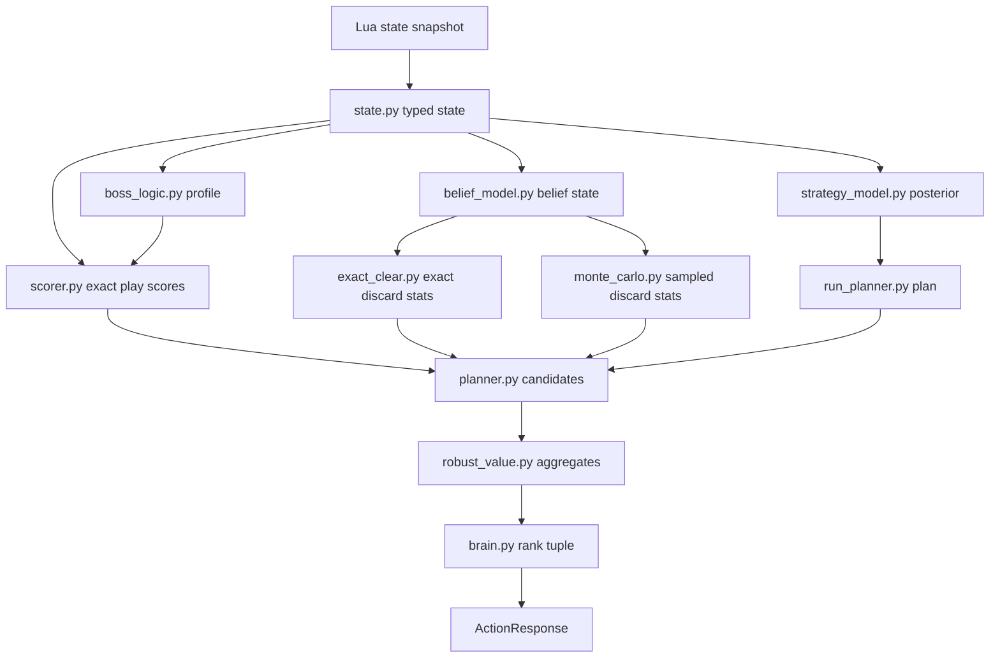

## 2. State Variables

The normalized runtime state is:

$$
s
=
(
\mu,\beta,\epsilon,H,J,D,R,C,L,Q,P
)
$$

where:

- $\mu$ is metadata: seed, ante, round, phase, stake, deck identity, and pack/blind context.
- $\beta$ is blind state: name, target score, current score, boss modifier, and boss flag.
- $\epsilon$ is economy: money, hands left, discards left, hand size, reroll cost, interest, and slots.
- $H$ is current hand.
- $J$ is joker set.
- $D$ is the visible draw pile if known.
- $R$ is discard pile.
- $C$ is consumables.
- $L$ is hand-level table.
- $Q$ is shop inventory.
- $P$ is pack inventory.

The immediate remaining score is:

$$
r(s)=\beta_{\text{target}}-\beta_{\text{current}}.
$$

The current number of available hands and discards are:

$$
h(s)=\epsilon_{\text{hands}},
\qquad
d(s)=\epsilon_{\text{discards}}.
$$

## 3. Action Space

For selecting-hand decisions, the Python planner evaluates play and discard actions.

The play action set is:

$$
\mathcal{A}_{\text{play}}(s)
=
\left\{
A\subseteq H:
1\le |A|\le \min(5,|H|)
\right\}.
$$

The discard action set is:

$$
\mathcal{A}_{\text{discard}}(s)
=
\left\{
B\subseteq H:
1\le |B|\le \min(5,|H|)
\right\}
\quad
\text{if } d(s)>0.
$$

The root candidate set is:

$$
\mathcal{A}(s)
=
\mathcal{A}_{\text{play}}(s)
\cup
\mathcal{A}_{\text{discard}}(s).
$$

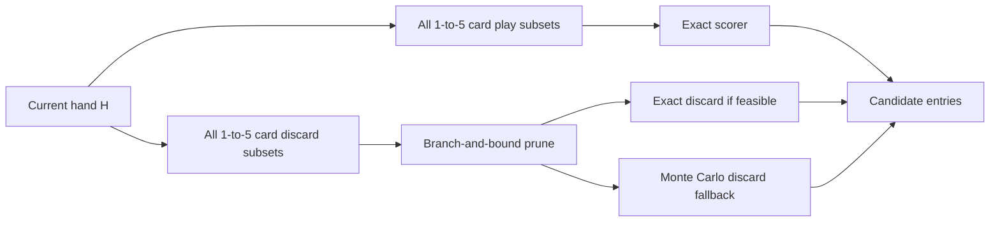

## 4. Boss Profile Mathematics

`boss_profile_from_state` maps the blind name to a profile:

$$
\pi_b(s)
=
(
u,\phi,\psi,\eta,\lambda,\omega,\tau,g_C,g_M,\rho,\kappa,\gamma
)
$$

where:

- $u$ is the debuffed suit, if any.
- $\phi=1$ means face cards are debuffed.
- $\psi=1$ means the play must use five cards.
- $\eta=1$ means repeated hand types are illegal.
- $\lambda=1$ means the round is locked to the first hand type.
- $\omega=1$ means money is set to zero for the most-played hand.
- $\tau$ is money lost per played card.
- $g_C,g_M$ scale base chips and base mult.
- $\rho$ is future penalty.
- $\kappa$ is joker uncertainty penalty.
- $\gamma$ is immediate clear-pressure bonus.

Illegal play indicator:

$$
I_{\text{illegal}}(a,s)
=
\mathbf{1}[\psi=1\land |a|<5]
\lor
\mathbf{1}[\eta=1\land n_{\text{round}}(T(a))>0]
\lor
\mathbf{1}[
\lambda=1
\land T_{\text{locked}}(s)\ne\varnothing
\land T(a)\ne T_{\text{locked}}(s)
].
$$

Base-score scaling:

$$
C_0'=g_C C_0,
\qquad
M_0'=g_M M_0.
$$

Post-play money is:

$$
m'
=
\max\left(
0,
\left(1-I_{\text{Ox}}I[T(a)=T_{\text{most}}]\right)
\left(m+\Delta m_{\text{joker}}\right)
-\tau |a|
\right).
$$

Future-play preservation receives a boss penalty:

$$
F_{\text{future}}
=
\max\left(0,S(a)-\frac{r}{\max(1,h)}\right)
-
\rho\frac{r}{\max(1,h)}.
$$

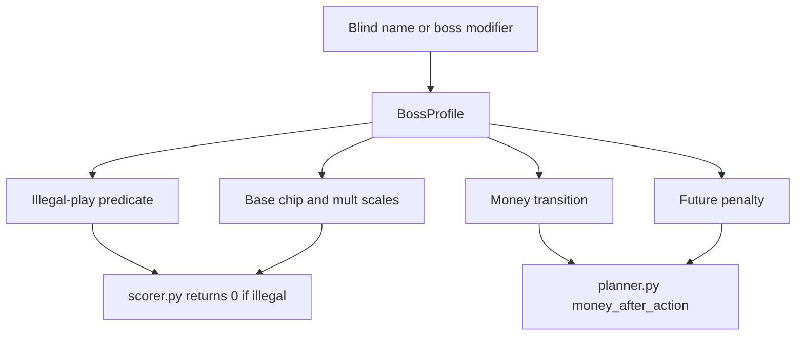

## 5. Hand Classification

Only active jokers enter classification:

$$
J^+
=
\{j\in J:\operatorname{debuffed}(j)=0\}.
$$

The hand priority order is:

$$
\mathcal{T}
=
[
\text{Flush Five},
\text{Flush House},
\text{Five of a Kind},
\text{Straight Flush},
\text{Four of a Kind},
\text{Full House},
\text{Flush},
\text{Straight},
\text{Three of a Kind},
\text{Two Pair},
\text{Pair},
\text{High Card}
].
$$

For played cards $A$, define the matching subsets for hand type $t$:

$$
\mathcal{B}_t(A,J^+)
=
\{B\subseteq A:1\le |B|\le 5,\ M_t(B,J^+)=1\}.
$$

The selected hand type is the first matching type in priority order:

$$
T(A,J^+)
=
\min_{\mathcal{T}}
\{t:\mathcal{B}_t(A,J^+)\ne\varnothing\}.
$$

The selected scoring subset is the best subset under the code's deterministic subset key:

$$
\widehat{B}
=
\operatorname*{argmax}_{B\in\mathcal{B}_{T(A,J^+)}}
K_{\text{subset}}(B).
$$

The subset key is:

$$
K_{\text{subset}}(B)
=
\left(
|B|,
\sum_{c\in B}v_{\text{card}}(c),
\operatorname{sort}_{\downarrow}\{r(c):c\in B\},
\operatorname{sort}\{\operatorname{id}(c):c\in B\}
\right).
$$

`Splash` replaces the scoring subset with all played cards:

$$
B_{\text{score}}
=
\begin{cases}
A, & \text{if Splash}\in J^+,\\
\widehat{B}, & \text{otherwise}.
\end{cases}
$$

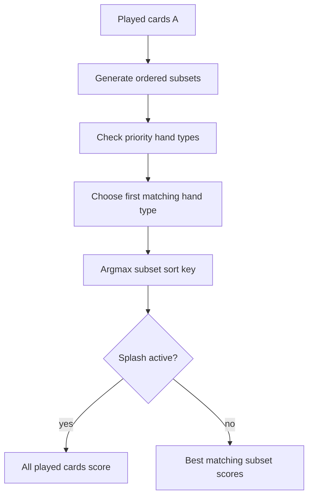

## 6. Flush, Straight, Stone, Wild, And Suit Logic

Four Fingers lowers flush and straight requirements:

$$
\rho_F(J^+)
=
\begin{cases}
4, & \text{if Four Fingers}\in J^+,\\
5, & \text{otherwise},
\end{cases}
\qquad
\rho_S(J^+)
=
\rho_F(J^+).
$$

Suit matching is:

$$
\operatorname{matchSuit}(c,u,J^+)
=
\begin{cases}
0, & c\text{ is Stone},\\
1, & c\text{ is Wild},\\
\mathbf{1}[\operatorname{color}(c)=\operatorname{color}(u)], & \text{if Smeared Joker}\in J^+,\\
\mathbf{1}[\operatorname{suit}(c)=u], & \text{otherwise}.
\end{cases}
$$

Flush predicate:

$$
\operatorname{Flush}(B,J^+)
=
\mathbf{1}\left[
|B|\ge \rho_F(J^+)
\land
\exists u\in\{\text{Spades},\text{Hearts},\text{Clubs},\text{Diamonds}\}:
\forall c\in B,\operatorname{matchSuit}(c,u,J^+)=1
\right].
$$

Straight predicate:

$$
\operatorname{Straight}(B,J^+)
=
\mathbf{1}\left[
|B|\ge \rho_S(J^+)
\land
\operatorname{uniqueRanks}(B)
\land
\neg \operatorname{hasStone}(B)
\land
\operatorname{runOK}(B,J^+)
\right].
$$

`Shortcut` allows one rank gap of size two:

$$
\operatorname{runOK}(v,J^+)
=
\mathbf{1}
\left[
\sum_i \mathbf{1}[v_i-v_{i+1}=2]\le \mathbf{1}[\text{Shortcut}\in J^+]
\land
\forall i,\ v_i-v_{i+1}\in\{1,2\}
\right],
$$

with an alternate Ace-low representation checked when Ace is present.

## 7. Debuff-Aware Scoring

Classification uses all played cards, but score contributions exclude debuffed scoring and held cards.

The card debuff predicate is:

$$
\delta(c;s,J^+)
=
\mathbf{1}[c_{\text{debuffed}}]
\lor
\mathbf{1}[\phi=1\land \operatorname{face}(c,J^+)]
\lor
\mathbf{1}[u\ne\varnothing\land \operatorname{matchSuit}(c,u,J^+)].
$$

The active scoring and held sets are:

$$
B_{\text{active}}
=
\{c\in B_{\text{score}}:\delta(c;s,J^+)=0\},
\qquad
H_{\text{held}}^+
=
\{c\in H\setminus A:\delta(c;s,J^+)=0\}.
$$

This is the critical invariant fixed in the audit:

$$
\text{Debuffed cards may define }T(A,J^+),
\quad
\text{but they cannot add chips, mult, xmult, held effects, or money effects.}
$$

## 8. Scoring Pipeline

Let the hand-level table supply base values:

$$
(C_0,M_0)
=
\begin{cases}
(L_T^{\text{chips}},L_T^{\text{mult}}), & T\in L,\\
(C_T^{\text{default}},M_T^{\text{default}}), & \text{otherwise}.
\end{cases}
$$

After boss scaling:

$$
C\leftarrow g_C C_0,
\qquad
M\leftarrow g_M M_0,
\qquad
X\leftarrow 1.
$$

Card effects update:

$$
C
\leftarrow
C+\sum_{c\in B_{\text{active}}}
\left(
\operatorname{baseChips}(c)
+\operatorname{bonusChips}(c)
+\operatorname{cardChipJokers}(c,J^+)
+\operatorname{editionChips}(c)
\right).
$$

$$
M
\leftarrow
M+\sum_{c\in B_{\text{active}}}
\left(
\operatorname{cardMult}(c)
+\operatorname{rankMultJokers}(c,J^+)
+\operatorname{suitMultJokers}(c,J^+)
+\operatorname{editionMult}(c)
\right).
$$

$$
X
\leftarrow
X
\prod_{c\in B_{\text{active}}}
\operatorname{cardX}(c,J^+)
\prod_{c\in H_{\text{held}}^+}
\operatorname{heldX}(c)
\prod_{j\in J^+}
\operatorname{jokerX}(j,s,A,H_{\text{held}}^+).
$$

Joker additive chip/mult effects are then applied:

$$
C\leftarrow C+\Delta C_J(s,A,H,J^+),
\qquad
M\leftarrow M+\Delta M_J(s,A,H,J^+).
$$

The final score is:

$$
S(a,s)
=
\operatorname{round}\left(
\max(0,C M X)
\right).
$$

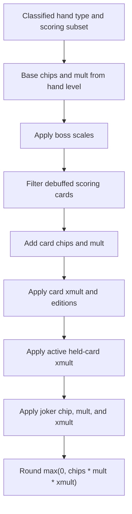

## 9. Explicit Joker Formulas

Bootstraps:

$$
\Delta M_{\text{Bootstraps}}
=
m_{\text{step}}
\left\lfloor
\frac{m}{d_{\text{step}}}
\right\rfloor,
\qquad
m_{\text{step}}=2,\quad d_{\text{step}}=5.
$$

Bloodstone expected deterministic xmult per active Heart scoring card:

$$
X_{\text{Bloodstone, per Heart}}
=
1+\frac{x_{\text{proc}}-1}{o},
\qquad
x_{\text{proc}}=1.5,\quad o=2.
$$

With $n_H$ active Heart scoring cards:

$$
X_{\text{Bloodstone}}
=
\left(1+\frac{x_{\text{proc}}-1}{o}\right)^{n_H}.
$$

Baron:

$$
X_{\text{Baron}}
=
x_{\text{king}}^{n_K},
\qquad
n_K
=
|\{c\in H_{\text{held}}^+:r(c)=\text{King}\}|.
$$

Driver's License:

$$
X_{\text{Driver}}
=
\begin{cases}
x_{\text{driver}}, & N_{\text{modified}}(s)\ge 16,\\
1, & \text{otherwise}.
\end{cases}
$$

Rough Gem money estimate:

$$
\Delta m_{\text{RoughGem}}
=
g_{\text{diamond}}
\left|
\{c\in B_{\text{active}}:\operatorname{matchSuit}(c,\text{Diamonds},J^+)=1\}
\right|.
$$

## 10. Exact Discard Solver

For discard set $B$, the post-discard base hand is:

$$
H_B=H\setminus B,
\qquad
k=|B|.
$$

Exact enumeration is allowed when:

$$
\binom{|D|}{k}
\le
N_{\text{cap}},
\qquad
N_{\text{cap}}=\texttt{EXACT\_DRAW\_ENUM\_CAP}.
$$

For raw exact combinations:

$$
\Omega_k(D)
=
\{X\subseteq D:|X|=k\}.
$$

The best score after a draw $X$ is:

$$
Y(X)
=
\max_{A\in\mathcal{A}_{\text{play}}(H_B\cup X)}
S(A,H_B\cup X,s).
$$

Raw exact statistics use uniform combination weights:

$$
\widehat{\mu}_{\text{raw}}
=
\frac{1}{|\Omega_k(D)|}
\sum_{X\in\Omega_k(D)}Y(X).
$$

When equivalent cards can be aggregated into categories $1,\dots,q$, with category totals $N_i$ and draw vector $x_i$, the probability is:

$$
\Pr(X=x)
=
\frac{\prod_{i=1}^{q}\binom{N_i}{x_i}}
{\binom{\sum_i N_i}{k}},
$$

subject to:

$$
\sum_i x_i=k,
\qquad
0\le x_i\le N_i.
$$

The category-aggregated exact mean is:

$$
\widehat{\mu}_{\text{cat}}
=
\sum_x
Y(x)
\frac{\prod_i\binom{N_i}{x_i}}
{\binom{\sum_i N_i}{k}}.
$$

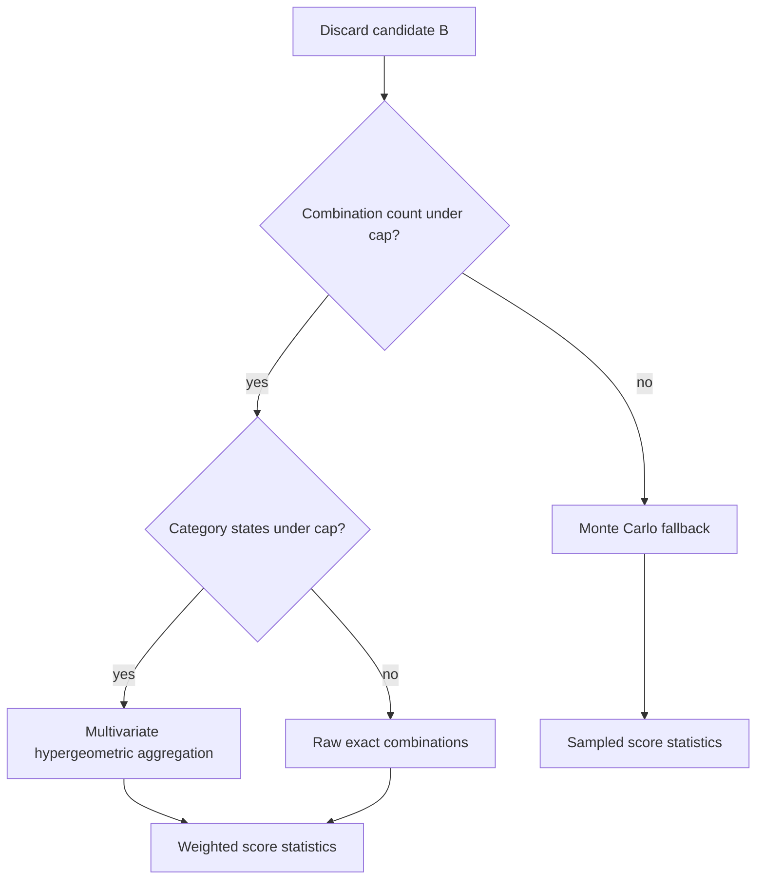

## 11. Branch-And-Bound Discard Generation

`DiscardBounder` recursively explores keep/discard decisions and prunes candidates that cannot plausibly clear.

The optimistic card value is:

$$
v_{\max}
=
\max_{c\in K\cup D}
\left(
\operatorname{baseChips}(c)
+50\mathbf{1}[\operatorname{edition}(c)=\text{Foil}]
+12\mathbf{1}[\operatorname{enhancement}(c)=\text{Mult}]
+20\mathbf{1}[\operatorname{enhancement}(c)=\text{Glass}]
\right).
$$

The optimistic round upper bound is:

$$
U(K)
=
\left(100+5v_{\max}\right)
\left(8\cdot 1.5^{\min(3,n_{\text{Steel}})}\right)
\max(1,h).
$$

Sound prune:

$$
U(K)<r(s)
\quad\Rightarrow\quad
\text{discard branch cannot clear the round under this bound.}
$$

The heuristic discard candidate priority is:

$$
P_{\text{discard}}(B)
=
\sum_{c\in B}\operatorname{keep}(c)
+P_{\text{flushBreak}}(B)
+P_{\text{straightBreak}}(B)
+P_{\text{size}}(B).
$$

Cards with lower $P_{\text{discard}}$ are evaluated earlier because the code sorts ascending.

## 12. Monte Carlo Sampling

The nominal ordered draw law for $x=(x_1,\dots,x_k)$ from a deck of size $N$ is:

$$
p(x)
=
\prod_{t=0}^{k-1}
\frac{1}{N-t}.
$$

The tilted one-step weight for card $c$ is:

$$
a(c)
=
1
+0.75\,n_{\text{suit}(c)}(H)
+1.25\,n_{\text{rank}(c)}(H)
+0.75\,I_{\text{neighbor}}(c,H)
+0.25\,I_{\text{faceOrAce}}(c)
+0.50\,I_{\text{enhanced}}(c)
+0.40\,I_{\text{edition}}(c)
+0.30\,I_{\text{seal}}(c).
$$

The biased one-step law is:

$$
b_t(c)
=
\frac{a(c)}
{\sum_{z\in D_t}a(z)}.
$$

The defensive mixture proposal is:

$$
q_t(c)
=
\frac{1-\varepsilon}{|D_t|}
+\varepsilon b_t(c),
\qquad
\varepsilon=\texttt{MC\_IS\_MIXTURE\_EPSILON}.
$$

The proposal probability for the sequence is:

$$
q(x)
=
\prod_{t=0}^{k-1}q_t(x_{t+1}).
$$

The importance weight is:

$$
w(x)
=
\frac{p(x)}{q(x)}.
$$

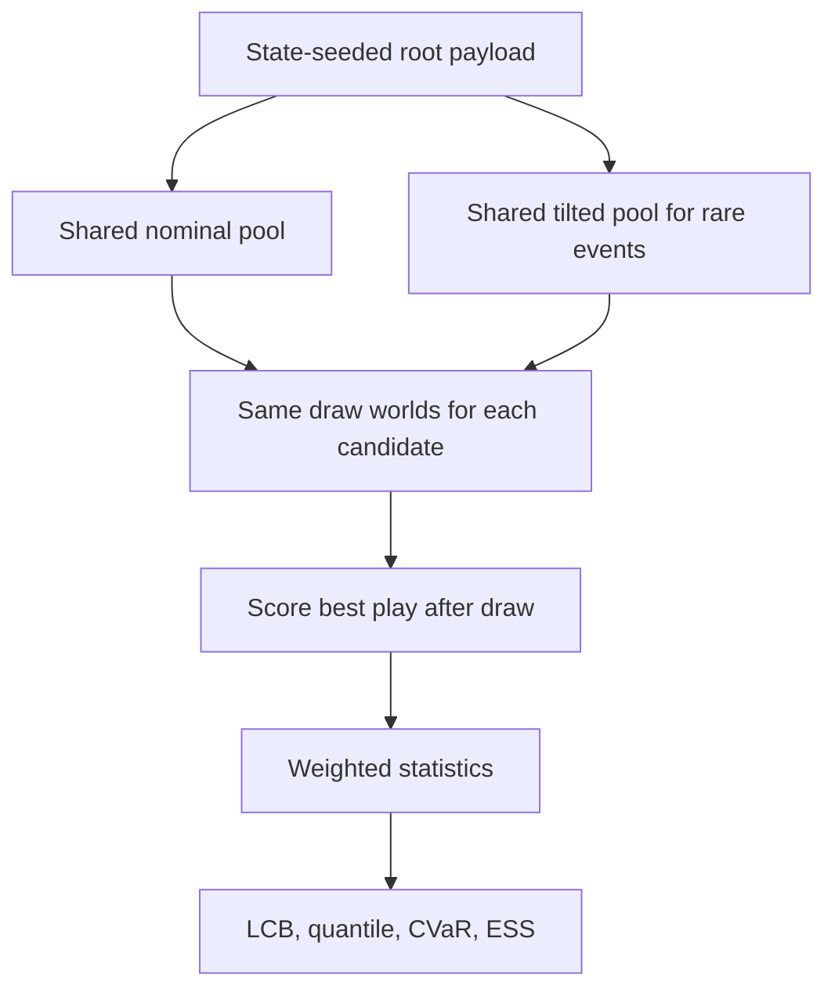

## 13. Weighted Risk Statistics

Given sampled scores $y_i$ and weights $w_i$, the weighted mean is:

$$
\bar{y}_w
=
\frac{\sum_i w_i y_i}{\sum_i w_i}.
$$

Weighted variance:

$$
\sigma_w^2
=
\frac{\sum_i w_i(y_i-\bar{y}_w)^2}{\sum_i w_i}.
$$

Effective sample size:

$$
\operatorname{ESS}
=
\frac{\left(\sum_i w_i\right)^2}{\sum_i w_i^2}.
$$

Standard error and confidence margin:

$$
\operatorname{SE}
=
\frac{\sigma_w}{\sqrt{\max(1,\operatorname{ESS})}},
\qquad
\operatorname{margin}
=
c_{\text{MC}}\cdot 1.96\cdot \operatorname{SE}.
$$

Clear probability:

$$
\widehat{p}_{\text{clear}}
=
\frac{\sum_i w_i\mathbf{1}[y_i\ge r]}{\sum_i w_i}.
$$

Wilson lower confidence bound:

$$
\operatorname{LCB}(p,n)
=
\frac{
p+\frac{z^2}{2n}
-z\sqrt{\frac{p(1-p)}{n}+\frac{z^2}{4n^2}}
}{
1+\frac{z^2}{n}
}.
$$

Weighted lower quantile:

$$
Q_\alpha
=
\inf\left\{y:
\sum_{i:y_i\le y}w_i
\ge
\alpha\sum_i w_i
\right\}.
$$

CVaR-style tail loss:

$$
L_i
=
\max(0,r-y_i),
\qquad
\operatorname{CVaR}_{\alpha}^{\text{loss}}
=
\frac{1}{\alpha\sum_iw_i}
\int_{\text{largest }\alpha\text{ weighted mass}} L\,dW.
$$

Expected and risk-adjusted improvement:

$$
\Delta_{\text{mean}}
=
\max(0,\bar{y}_w-y_{\text{best}}),
\qquad
\Delta_{\text{risk}}
=
\max(0,\bar{y}_w-\operatorname{margin}-y_{\text{best}}).
$$

## 14. Control Variate

The runtime proxy is the count of helpful draw cards. A card is helpful when it shares suit, matches rank, or lies within rank distance two of the kept hand.

The proxy expectation is:

$$
\mathbb{E}[H]
=
k
\frac{N_{\text{helpful}}}{N}.
$$

The weighted control coefficient is:

$$
\widehat{\beta}
=
\frac{\operatorname{Cov}_w(Y,H)}
{\operatorname{Var}_w(H)}.
$$

Adjusted scores are:

$$
Y_i'
=
Y_i-\widehat{\beta}\left(H_i-\mathbb{E}[H]\right).
$$

These adjusted scores are passed into the same weighted statistics pipeline.

## 15. Belief Model And Robust Rule Posterior

If the draw pile is visible:

$$
\mathcal{D}_{\text{belief}}=D,
\qquad
w_D=1.
$$

If the draw pile is absent, the deck is inferred as:

$$
\mathcal{D}_{\text{belief}}
=
\mathcal{D}_{52}
\setminus
\operatorname{seen}(H,R,D).
$$

For unresolved active jokers:

$$
u_J=|\{j\in J:j_{\text{debuffed}}=0\}|.
$$

If $u_J=0$, the only model is nominal:

$$
\mathcal{M}
=
\{(\text{nominal},1,1,\kappa)\}.
$$

If $u_J>0$, the posterior contains:

$$
\mathcal{M}
=
\{
(\text{lower},0.25,1,p_L),
(\text{nominal},0.55,1,p_N),
(\text{upper},0.20,1,0)
\}.
$$

with penalties:

$$
p_L
=
\min(0.50,\min(0.35,0.035u_J)+\kappa),
$$

$$
p_N
=
\min(0.30,\min(0.18,0.015u_J)+0.6\kappa).
$$

The diagnostic entropy stored by the code is:

$$
\mathcal{H}
=
-\sum_{w\in W}w\log w,
\qquad
W=\{w_{\text{deck particles}}\}\cup\{w_{\text{rule models}}\}.
$$

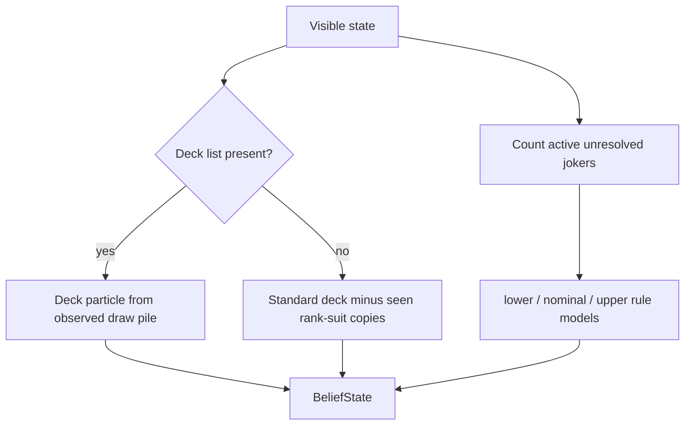

## 16. Robust Aggregation And Minimax Regret

For base clear probability $p$ and base score $y$, each rule model $m$ produces:

$$
p_m
=
\operatorname{clip}_{[0,1]}(p-\operatorname{penalty}_m),
\qquad
y_m
=
\max(0,y\cdot \operatorname{scale}_m).
$$

Model value:

$$
V_m(a)
=
1000p_m+y_m.
$$

Bayesian-model-averaged clear probability and score:

$$
p_{\text{BMA}}(a)
=
\sum_m w_m p_m,
\qquad
y_{\text{BMA}}(a)
=
\sum_m w_m y_m.
$$

Conservative lower envelope:

$$
p_{\text{cons}}(a)=\min_m p_m,
\qquad
y_{\text{cons}}(a)=\min_m y_m.
$$

The planner computes regret with a richer surrogate:

$$
U_m(a)
=
p_m(a)\left(1000+160\gamma\right)
+\frac{\min(y_m(a),r)}{\max(1,r)}
+R_{\text{resource}}(a)
+I_{\text{immediate}}(a)
-0.05\,\operatorname{OverkillNorm}(a).
$$

where:

$$
R_{\text{resource}}(a)
=
\frac{h_a+0.5d_a}{10},
\qquad
\operatorname{OverkillNorm}(a)
=
\operatorname{clip}_{[0,1]}
\left(
\frac{\max(0,y(a)-r)}{\max(1,r)}
\right).
$$

Minimax regret:

$$
\operatorname{Regret}(a)
=
\max_m
\left(
\max_{a'\in\mathcal{A}}U_m(a')
-U_m(a)
\right).
$$

## 17. Play Entry Features

For a play action $a$ with exact score $S(a,s)$:

$$
I_{\text{lethal}}(a)
=
\mathbf{1}[S(a,s)\ge r(s)].
$$

Remaining target and hands after action:

$$
r_a=\max(0,r-S(a,s)),
\qquad
h_a=\max(0,h-1).
$$

The heuristic clear probability used for nonlethal plays is:

$$
\widehat{p}_{\text{heur}}(y,r,h)
=
\begin{cases}
1.00, & r\le 0,\\
0.00, & h\le 0,\\
0.95, & yh\ge 1.2r,\\
0.80, & yh\ge r,\\
0.50, & yh\ge 0.8r,\\
0.10, & \text{otherwise}.
\end{cases}
$$

For nonlethal plays:

$$
p_{\text{lcb}}
=
\max(0,\widehat{p}_{\text{heur}}-0.10).
$$

The play feature vector contains:

$$
f_{\text{play}}
=
(
p_{\text{heur}},
p_{\text{lcb}},
S,
S-r,
h_a,
d,
m',
|a|,
F_{\text{future}},
\max(0,S-r),
\max(0,r-S)
).
$$

## 18. Tactical Mode

The survival threshold is:

$$
\Gamma
=
\min(
0.99,
\Gamma_0
+\Gamma_{\text{boss}}\mathbf{1}[\beta_{\text{boss}}]
+\Gamma_{\text{stake}}\mathbf{1}[\text{stake}\ge 5]
+0.01\mathbf{1}[h\le 2]
).
$$

The scale and panic thresholds are:

$$
\Gamma_{\text{scale}}=\min(0.995,\Gamma+0.02),
\qquad
\Gamma_{\text{panic}}=\max(0.35,\Gamma-0.40).
$$

Mode selection:

$$
\operatorname{mode}(s)
=
\begin{cases}
\text{LETHAL}, & y_{\max}\ge r,\\
\text{PANIC}, & p_{\text{cons}}<\Gamma_{\text{panic}}\land h\le1\land d\le0,\\
\text{SCALING\_PRESERVE}, & p_{\text{cons}}\ge\Gamma_{\text{scale}}\land h>1,\\
\text{SAFE\_CLEAR}, & p_{\text{cons}}\ge\Gamma,\\
\text{DESPERATION}, & \text{otherwise}.
\end{cases}
$$

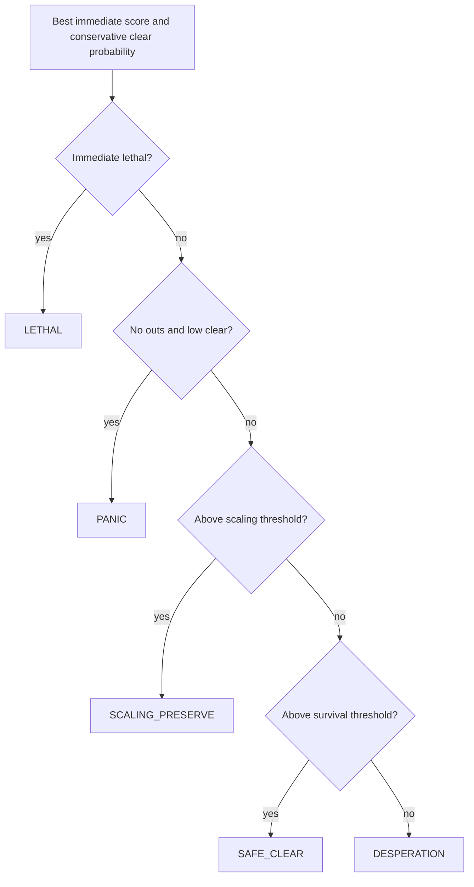

## 19. Utility And Lexicographic Rank Tuple

The scalar utility is retained for diagnostics:

$$
U_{\text{scalar}}
=
1.15w_s p_{\text{lcb}}
+w_s p
+w_p(h_a+d_a)
+w_e\frac{y}{\max(1,|a|)}
+w_r\sigma^2
+w_o O
+w_f F
+5Q_{\text{discard}}
-0.6L_{\text{CVaR}}
-4\operatorname{Regret}.
$$

The actual root ordering is lexicographic. Let:

$$
R_{\text{cards}}
=
h_a+0.6d_a+0.05m_a,
\qquad
E_{\text{card}}
=
\frac{y}{\max(1,|a|)}.
$$

The rank tuple is:

$$
\operatorname{Rank}(a)
=
\operatorname{Lex}
\left(
p_{\text{lcb}},
p,
-\operatorname{Regret}/1000,
I_{\text{immediate}},
\frac{y-L_{\text{CVaR}}}{r},
\frac{F}{r/h},
\frac{y}{r},
\frac{Q_{\text{discard}}}{r/h},
\frac{R_{\text{cards}}}{10},
-O/r,
\frac{E_{\text{card}}}{r/h},
\text{modeBonus},
\text{actionPriority},
-|a|,
\operatorname{ids}(a)
\right).
$$

`brain.py` sorts these tuples descending after rounding numeric components to eight decimals.

## 20. Strategy Posterior

The strategy model produces archetype scores $z_a$ and posterior probabilities:

$$
\Pr(a\mid s)
=
\frac{\exp(z_a-z_{\max})}
{\sum_b\exp(z_b-z_{\max})}.
$$

Core deck metrics are:

$$
\operatorname{maxSuitShare}
=
\frac{\max_u n_u}{N},
\qquad
\operatorname{faceRatio}
=
\frac{n_{\text{face}}}{N},
$$

$$
\operatorname{rankDup}
=
\frac{\sum_r\max(0,n_r-1)}{N},
\qquad
\operatorname{exactDup}
=
\frac{\sum_g\max(0,n_g-1)}{N}.
$$

Held-in-hand support:

$$
\operatorname{heldSupport}
=
12\operatorname{steelRatio}
+8\operatorname{blueSealRatio}.
$$

The posterior is an additive evidence model:

$$
z_a
=
z_a^{\text{stake}}
+z_a^{\text{deck metrics}}
+z_a^{\text{draw metrics}}
+z_a^{\text{deck priors}}
+z_a^{\text{economy}}
+z_a^{\text{boss}}
+z_a^{\text{jokers}}
+z_a^{\text{consumables}}.
$$

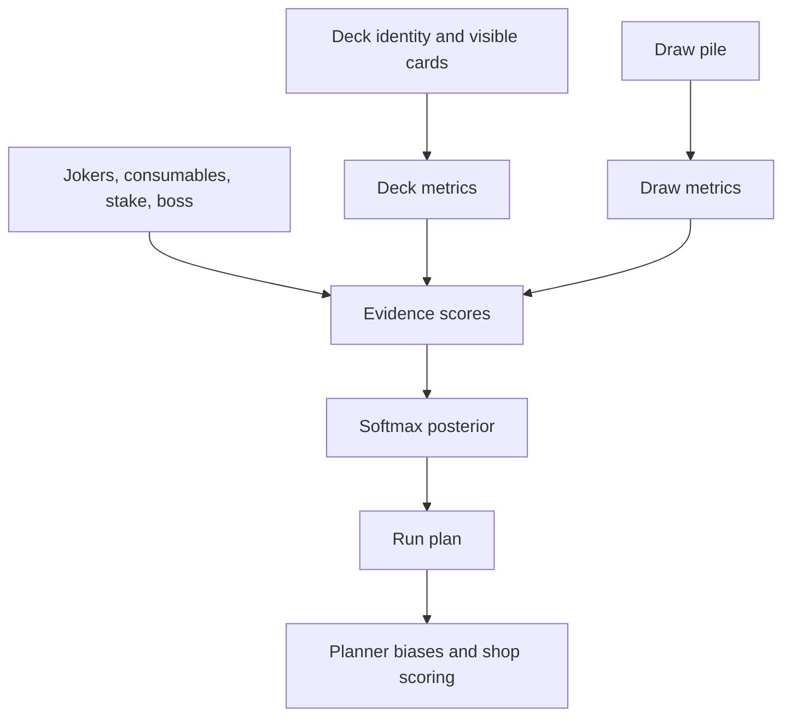

## 21. Run Plan And Role Deficits

The run planner chooses a target hand, accepted backups, role scores, role targets, deficits, hard needs, economy floor, reroll aggression, and pack preferences.

For each role $r$:

$$
d_r
=
\max(0,T_r-R_r).
$$

Hard needs are:

$$
\mathcal{N}_{\text{hard}}
=
\{r:d_r\ge 0.55\}.
$$

Conversion readiness:

$$
I_{\text{conversion}}
=
\mathbf{1}
\left[
R_{\text{chips}}\ge0.85T_{\text{chips}}
\land
R_{\text{mult}}\ge0.85T_{\text{mult}}
\land
(m\ge25\lor I_{\text{noInterest}}\lor I_{\text{spendAggressively}})
\right].
$$

Reroll aggression is:

$$
A_{\text{reroll}}
=
\operatorname{clip}_{[0,1]}
\left(
A_{\text{stage}}
+A_{\text{blueprint}}
+\min(0.20,0.05|\mathcal{N}_{\text{hard}}|)
+\min(0.20,0.12\max(0,d_{\max}-0.80))
+0.15I_{\text{ignoreInterest}}
\right).
$$

## 22. Shop And Pack Scoring

Strategy-model item synergy:

$$
E_{\text{syn}}(i)
=
\sum_a
\Pr(a\mid s)\,v_i(a).
$$

Strategy-model item score:

$$
V_{\text{model}}(i)
=
B_i
+4E_{\text{syn}}(i)
+E_i
+G_i
+P_i
-S_i
-C_i.
$$

where $B_i$ is base item value, $E_i$ edition bonus, $G_i$ stage bonus, $P_i$ run-plan adjustment, $S_i$ sticker penalty, and $C_i$ cost penalty.

The shop blends legacy and strategy scores:

$$
V_{\text{shop}}(i)
=
0.45V_{\text{legacy}}(i)
+0.55V_{\text{model}}(i).
$$

Build pressure:

$$
B_{\text{pressure}}
=
B_{\text{jokers}}
+B_{\text{ante}}
+0.8p_{\text{economy}}
+0.5p_{\text{deckGrowth}}
+1.1d_{\text{chips}}
+1.2d_{\text{mult}}
+\chi_{\text{xmult}}d_{\text{xmult}}
+0.6d_{\text{economy}}
+B_{\text{flags}}.
$$

Booster shop score:

$$
V_{\text{booster}}
=
B_{\text{kind}}
+(\operatorname{chooseCount}-1)
+0.35\max(0,\operatorname{cardCount}-2)
+G_{\text{stage}}
+G_{\text{target}}
+G_{\text{economy}}
-P_{\text{slot}}.
$$

Pack choice score is a family-specific value:

$$
V_{\text{pack}}(i)
=
\begin{cases}
V_{\text{standard}}(i), & i\text{ is a standard card},\\
V_{\text{planet}}(i), & i\text{ is a planet},\\
V_{\text{tarot}}(i), & i\text{ is a tarot},\\
V_{\text{spectral}}(i), & i\text{ is spectral},\\
V_{\text{model}}(i)+1.4+\Delta_{\text{slot}}, & i\text{ is a Buffoon joker},\\
V_{\text{model}}(i), & \text{otherwise}.
\end{cases}
$$

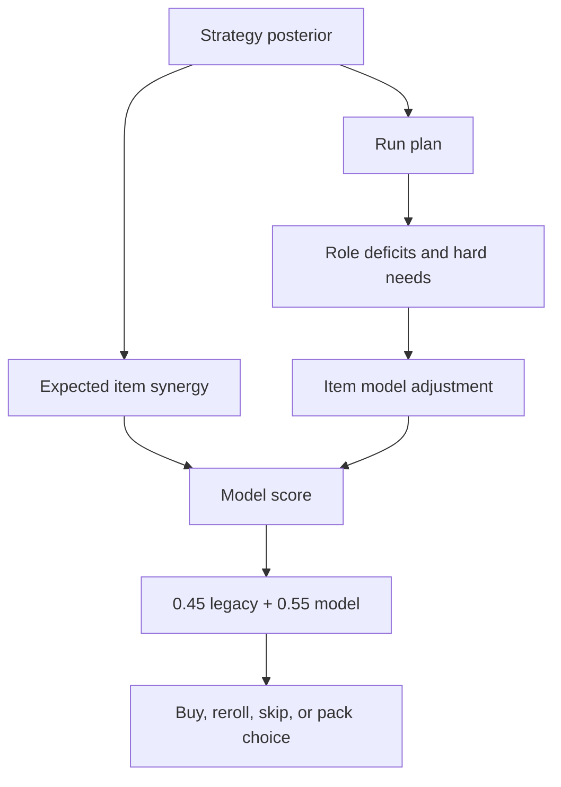

## 23. JS Solver Arbitration

The optional JavaScript solver evaluates a sampled beam search through `scripts/balatro_round_solver.js`. The Python planner accepts the JS result only if it matches a Python-ranked candidate and one of the acceptance conditions holds:

$$
\operatorname{acceptJS}
=
I_{\text{lethalReason}}
\lor I_{\text{pythonMatchedLethal}}
\lor I_{\text{earlyRiskSearch}}
\lor
\mathbf{1}
\left[
p_{\text{JS}}
\ge
p_{\text{leader,lcb}}-0.03
\right].
$$

This keeps JS useful as a parallel search advisor without letting it bypass the Python scorer and robust ranking.

## 24. Verification Map

| Mathematical invariant | Test or check |
| --- | --- |
| Debuffed cards classify hands but do not score | `tests/test_scorer.py` |
| Boss suit and face debuffs affect scoring cards and held effects | `tests/test_scorer.py` |
| `The Flint` and boss name path in JS solver | `tests/test_js_solver.py` |
| Weighted stats, ESS, CVaR, Wilson LCB | `tests/test_risk_metrics.py` if present, plus runtime MC diagnostics |
| Exact category aggregation | `tests/test_exact_clear.py` if present, plus exact solver smoke through planner |
| GitHub math rendering | Markdown scan for legacy parenthesis/bracket math delimiters, balanced display-math delimiters, and no equation-only `text` fences |

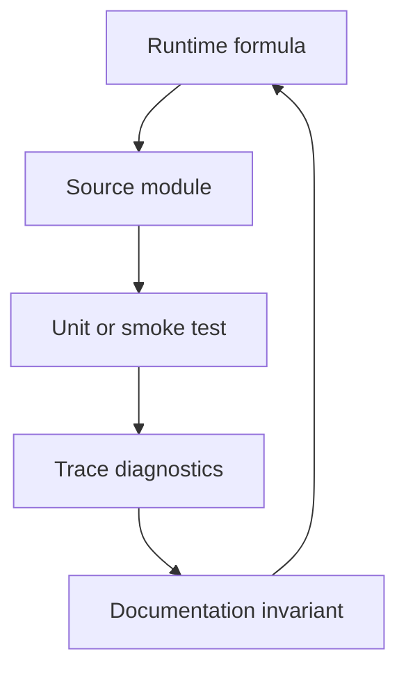
